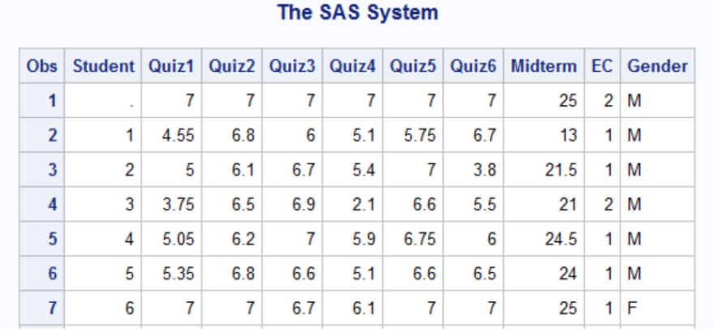
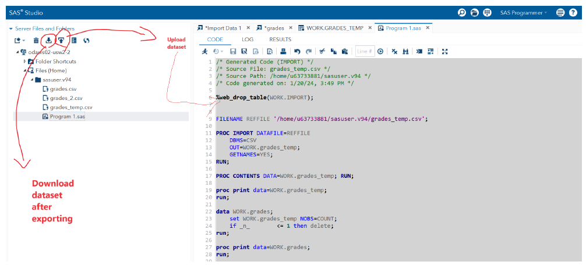

# Import and Export Dataset

> Learning objective:
>
> 1.  Import a csv file into SAS
> 2.  Export a csv file from SAS after data process

One of the strengths of SAS as a data analysis tool is its ability to read data from many sources, subset or combine data sets, and modify the datasets to accomplish various tasks. The most common types of external data sets used in SAS are EXCEL files (XLS extent), comma separated value files (CSV extent) and various space separate text files (PRN or TXT extent). A CSV file is actually a text file and can be read in any text reader (NOTEPAD or WORDPAD in Windows). In fact, the SAS files themselves, as well as the LOG and the LST files produced by a SAS by a batch submit, are also simple text files.

| Format  | Description                                   | File Extension |
|---------|-----------------------------------------------|----------------|
| WK1     | Lotus 1 spreadsheet                           | .WK1           |
| WK3     | Lotus 3 spreadsheet                           | .WK3           |
| WK4     | Lotus 4 spreadsheet                           | .WK4           |
| EXCEL   | Excel Version 4 or 5 spreadsheet              | .XLS           |
| EXCEL4  | Excel Version 4 spreadsheet                   | .XLS           |
| EXCEL5  | Excel Version 5 spreadsheet                   | .XLS           |
| EXCEL97 | Excel 97 spreadsheet                          | .XLS           |
| DLM     | delimited file (default delimiter is a blank) | .\*            |
| TAB     | delimited file (tab-delimited values)         | .TXT           |
| CSV     | delimited file (comma-separated values)       | .CSV           |

## Reading from External Files

The **PROC IMPORT** statement is the best way to enter external data sets. The CSV file we will be using is called “grades.csv”. Download and save it in your favourite folder and mark the complete path to it. Then use the following code to import it, making sure you put the correct path on the **DATAFILE** argument.

``` r
PROC IMPORT OUT= GRADES_temp
  DATAFILE= "Put Your Path Here/grades_temp.csv" DBMS=CSV REPLACE;
  GETNAMES=YES;
  DATAROW=2;
RUN;
```

The **IMPORT** statement reads the dataset and stores it as the value designated by “OUT” in this case it will be saved as “Grades” in the library “Work”.

The **DBMS** statement defines the type of input SAS should be reading. The following table gives you all the possible choices. The REPLACE argument forces SAS to overwrite any older datasets with the same name.

The **GETNAMES** = YES or NO statement for spreadsheets and delimited external files, determines whether to generate SAS variable names from the column names in the input file’s first row of data. If you specify **GETNAMES** = NO or if the column names are not valid SAS names, PROC IMPORT uses the variable names VAR0, VAR1, VAR2, and so on. You may replace the equals sign with a blank.

The **DATAROW** argument tells SAS where to start reading for input data. In our case it is row 2 since row 1 is used for variable names.

We use the print procedure to see the dataset,

``` r
PROC PRINT DATA=GRADES_temp;
RUN
```

The first few rows are shown as follows



## Export a File from SAS

After reading a dataset into SAS, we may need to conduct some initial step/analysis to re-organize dataset for doing further data analysis. In the *grade* example, the first row shows the maximum points available for each quiz. We need to remove this row so that our analysis is correct. This can be done by the following SAS code

``` r
DATA GRADES;
  SET GRADES_temp NOBS=COUNT
    IF _n_        <= 1 THEN DELETE;
RUN;
```

Note: GRADES_temp is the name of the old dataset and *GRADES* is the name of the new dataset after the first row is deleted.

After re-organize the dataset, we may want to export the updated dataset for use in the future:

This can be done by

``` r
PROC EXPORT DATA= GRADES
  OUTFILE= "Put Your Path Here/grade_v2.csv" DBMS=CSV REPLACE;
  REPLACE;
RUN;
```

We will talk about more reorganizing skills in SAS in the next topic.

::: callout-example
Which statement is true concerning the DATALINES statement based on reading the comment?

a.  The DATALINES statement is used when reading data located in a raw data file.

b.  The DATALINES statement is used when reading data located directly in the program.
:::

## Import & Export in SAS Virtual Studio

The key is

-   Upload data before conducting “Import”
-   Download data after conducting “Export”



A example given below will be demonstrated during the class.

``` r
/* Generated Code (IMPORT) */
/* Source File: grades_temp.csv */
/* Source Path: /home/u63733881/sasuser.v94 */
/* Code generated on: 1/20/24, 3:49 PM */

%web_drop_table(WORK.IMPORT);

FILENAME REFFILE '/home/u63733881/sasuser.v94/grades_temp.csv';

PROC IMPORT DATAFILE=REFFILE
    DBMS=CSV
    OUT=WORK.grades_temp;
    GETNAMES=YES;
RUN;

PROC CONTENTS DATA=WORK.grades_temp; 
RUN;

PROC print data=WORK.grades_temp;
RUN;

DATA WORK.grades;
SET WORK.grades_temp NOBS=COUNT;
IF _n_ <= 1 THEN DELTE;
RUN;

PROC PRINT DATA=WORK.grades;
RUN;

PROC EXPORT data=WORK.grades
    OUTFILE = "/home/u63733881/sasuser.v94/grades_2.csv"
    DBMS = csv
    REPLACE;
RUN;
```

## Solution to the example

Answer of the example: b
