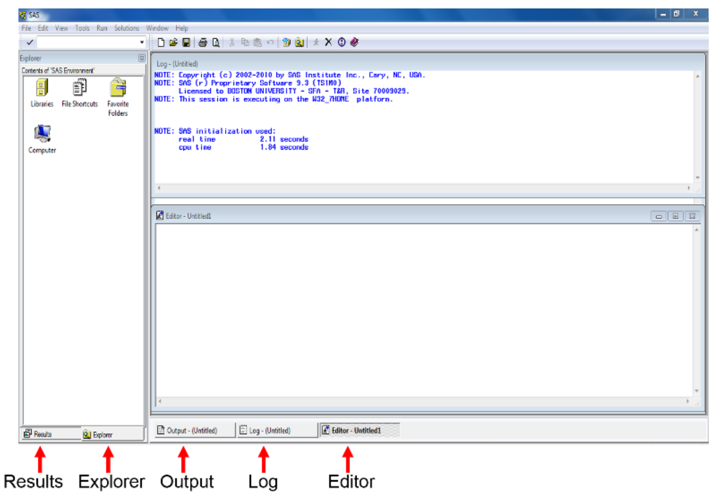

# Introduction to Basic SAS Operation

Learning objective:

1. Familiarize ourselves with SAS windows (editor, log, output)
2. Create a dataset
3. Sorting Data (by 1 or more variables)
4. Obtain summary statistics of variables

## Introduction to SAS

Q: Wha is SAS?

SAS (Statistical Analysis Software) is a prominent tool in the field of Data Analytics, offering a comprehensive suite for data manipulation, mining, management, and retrieval across various sources, coupled with robust statistical analysis capabilities. It excels in a range of functions including data management, statistical analysis, report generation, business modelling, application development, and data warehousing. SAS is user-friendly, featuring a point-and-click interface for
those without technical expertise, while also providing deeper functionality through the SAS programming language. This software is instrumental in employing qualitative methods and processes that enhance employee productivity and business profitability.

Within SAS, data extraction and categorization into tables are pivotal for identifying and understanding data trends. This versatile suite supports advanced analytics, business intelligence, predictive analysis, and data management, facilitating effective operation in dynamic and compet-
itive business environments. Additionally, SAS’s platform-independent nature allows it to operate seamlessly across various operating systems, including Linux, Windows, Mac, and Ubuntu. SAS provides extensive support to programmatically transform and analyze data in the comparison of drag and drop interface of other Business Intelligence tools. It provides very fine control over data manipulation and analysis.

### SAS Installzation

Georgia State University (GSU) has purchased license, so we can access SAS University Edition for free!

To install SAS University Edition, choose either of the options:

**Option 1**: Download on your personal PC: Free SAS license available to GSU students, faculty, and staff via Technology Services (download required; check system requirements):
Download from [https://technology.gsu.edu/technology-services/software-equipment/university-licensed-software/](https://technology.gsu.edu/technology-services/software-equipment/university-licensed-software/) (Need to log-in from your GSU Account)

Get Help for the Installation from [https://gsutech.service-now.com/sp](https://gsutech.service-now.com/sp)

**Option 2**:

+ On Campus Access: SAS can be found on all GSU Library PCs: Floors 1-4 (not available on
Library Macs, because there is no Mac version of SAS)

+ Graduate Biostatistics Computer Lab (SPH): 6th floor of the Urban Life building (swipe card
access required)

+ Common MILE Lab whose opening time is
    + Monday & Wednesday: 9 -- 18
    + Tuesday & Thursday: 9 -- 17
    + Friday: 9 -- 15

**Option 3**: Access via VLab, GSU’s Remote Desktop Environment. Download and Connect to Cisco AnyConnect Client to connect to GSU’s VPN (secureaccess.gsu.edu). Once connected
to the VPN, login to VLab at: https://vlab.gsu.edu/ to access SAS.

**Option 4**: Access via SAS OnDemand for Academics/SAS Studio. If you do not already have one, create a SAS profile at [https://welcome.oda.sas.com/](https://welcome.oda.sas.com/) Then, sign in with credentials and click SAS®Studio to access the web-based SAS environment.

### SAS Windows

Once SAS has started, the screen will look similar to the following:
The main SAS window is divided into several sub-windows:

+ The menu and toolbar along the top of the window
+ The explorer/results browser along the left hand side, where you can a listing of the results of successful SAS program.
+ The program editor below the log on the bottom right, where you create your SAS program
+ The windows bar along the bottom for you to switch all windows.

The Editor (Program Editor) window is a text editor that facilitates writing SAS programs (code).
The Log window displays system messages, errors, and resource usage and is thus used to review
program statements. The Output window displays output from statistical procedures run within
the SAS program; however this is no longer the default. In SAS 9.3 output is sent to the Results
Viewer which opens automatically when you run a procedure that generates output. The Results
window displays a map of the Output window, and is useful for navigating the results of complicated
analyses. Finally, the Explorer window contains all of the data sets in the current SAS session.

These windows can be moved or resized as desired. Only one SAS window is active at a time. The
active window will have a shaded title bar at the top of the window, and a highlighted windows
bar at the bottom of the screen. In the above example, the Program Editor is the active window,
with an ”Untitled” program name. Note that the menu options for the SAS toolbar along the top of the screen depend on which window is currently active. (The active window can be changed
by clicking on that window with the mouse, or by selecting the desired window from the Window
menu.)

## SAS Examples
