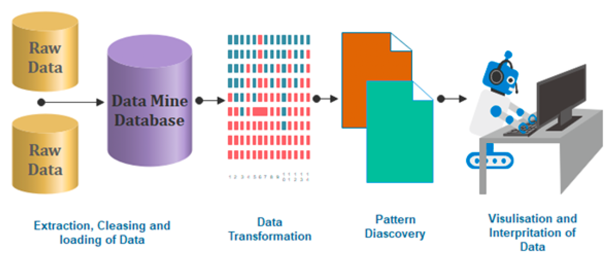
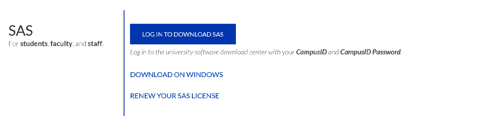
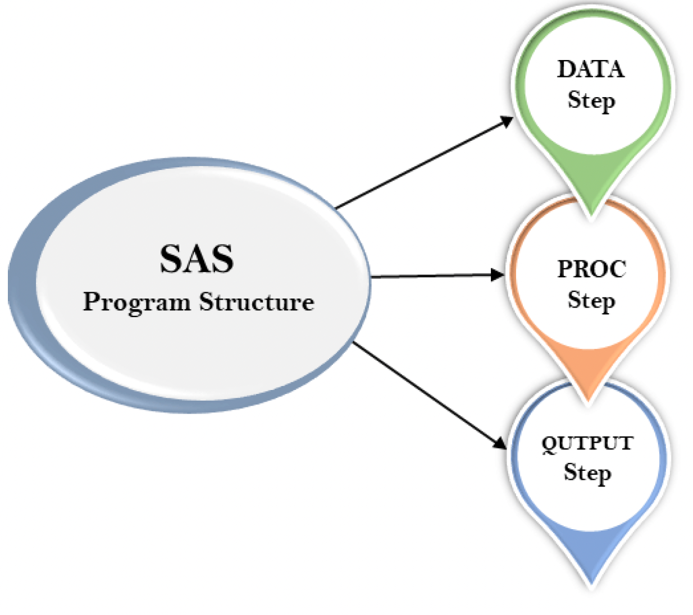
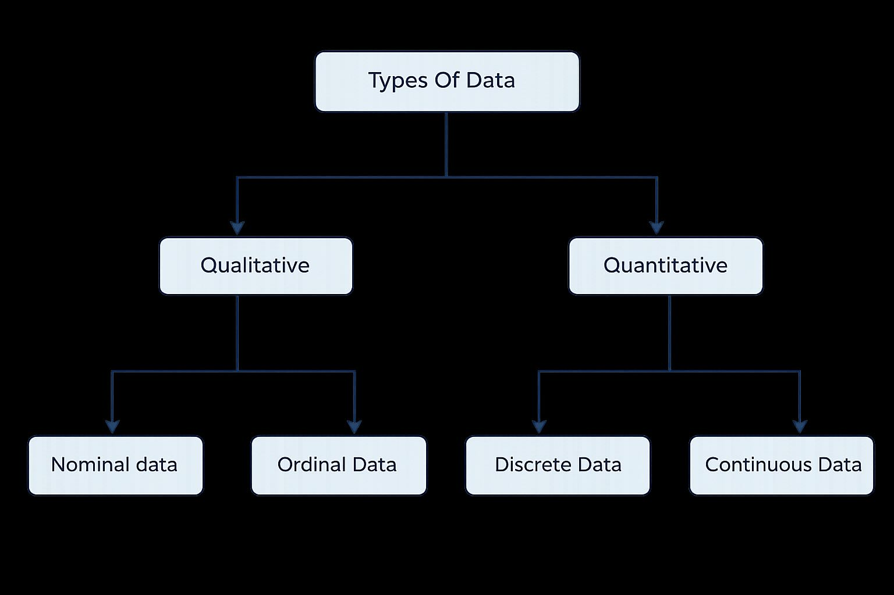

# Introduction to Basic SAS Operation

Learning objective:

1.  Familiarize ourselves with SAS windows (editor, log, output)
2.  Create a dataset
3.  Sorting Data (by 1 or more variables)
4.  Obtain summary statistics of variables

## Introduction to SAS

Q: What is SAS?

SAS (Statistical Analysis Software) is a prominent tool in the field of Data Analytics, offering a comprehensive suite for data manipulation, mining, management, and retrieval across various sources, coupled with robust statistical analysis capabilities. It excels in a range of functions including *data management, statistical analysis, report generation, business modelling, application development, and data warehousing*. SAS is user-friendly, featuring a point-and-click interface for those without technical expertise, while also providing deeper functionality through the SAS programming language. This software is instrumental in employing qualitative methods and processes that enhance employee productivity and business profitability.

Within SAS, data extraction and categorization into tables are pivotal for identifying and understanding data trends. This versatile suite supports advanced analytics, business intelligence, predictive analysis, and data management, facilitating effective operation in dynamic and compet- itive business environments. Additionally, SAS’s platform-independent nature allows it to operate seamlessly across various operating systems, including Linux, Windows, Mac, and Ubuntu. SAS provides extensive support to programmatically transform and analyze data in the comparison of drag and drop interface of other Business Intelligence tools. It provides very fine control over data manipulation and analysis.




### SAS Installzation

Georgia State University (GSU) has purchased license, so we can access SAS University Edition for free!

To install SAS University Edition, choose from the following options:

-   **Option 1**:

    Download on your personal PC: Free SAS license available to GSU students, faculty, and staff via Technology Services (download required; check system requirements): Download from <https://technology.gsu.edu/technology-services/software-equipment/university-licensed-software/> (Need to log-in from your GSU Account)



    Get Help for the Installation from <https://gsutech.service-now.com/sp>

-   **Option 2**:

    -   On Campus Access: SAS can be found on all GSU Library PCs: Floors 1-4 (not available on Library Macs, because there is no Mac version of SAS)

    -   Graduate Biostatistics Computer Lab (SPH): 6th floor of the Urban Life building (swipe card access required)

    -   Common MILE Lab whose opening time is

        -   Monday & Wednesday: 9 -- 18
        -   Tuesday & Thursday: 9 -- 17
        -   Friday: 9 -- 15

-   **Option 3**:

    Access via VLab, GSU’s Remote Desktop Environment. Download and Connect to Cisco AnyConnect Client to connect to GSU’s VPN (secureaccess.gsu.edu). Once connected to the VPN, login to VLab at: https://vlab.gsu.edu/ to access SAS.

-   **Option 4**:

    Access via SAS OnDemand for Academics/SAS Studio. If you do not already have one, create a SAS profile at <https://welcome.oda.sas.com/> Then, sign in with credentials and click SAS®Studio to access the web-based SAS environment.

### SAS Windows

Once SAS has started, the screen will look similar to the following: The main SAS window is divided into several sub-windows:


-   The menu and toolbar along the top of the window
-   The **explorer/results browser** along the left hand side, where you can a listing of the results of successful SAS program.
- The **log** to the top right. This gives you information about possible errors after you have run your SAS program.
-   The **program editor** below the log on the bottom right, where you create your SAS program.
- The windows bar along the bottom for you to switch all windows.


The **Editor (Program Editor)** window is a text editor that facilitates writing SAS programs (code). The Log window displays system messages, errors, and resource usage and is thus used to review program statements. The Output window displays output from statistical procedures run within the SAS program; however this is no longer the default. In SAS 9.3 output is sent to the Results Viewer which opens automatically when you run a procedure that generates output. The Results window displays a map of the Output window, and is useful for navigating the results of complicated analyses. Finally, the Explorer window contains all of the data sets in the current SAS session.

These windows can be moved or resized as desired. Only one SAS window is active at a time. The active window will have a shaded title bar at the top of the window, and a highlighted windows bar at the bottom of the screen. In the above example, the Program Editor is the active window, with an ”*Untitled*” program name. Note that the menu options for the SAS toolbar along the top of the screen depend on which window is currently active. (The active window can be changed by clicking on that window with the mouse, or by selecting the desired window from the Window menu.)

## SAS Program 

The programming structure of SAS consists of **three** significant steps:

+ **DATA** step: create and modify a SAS data set for follow-up analysis
+ **PROC** step: conduct data analysis
+ **OUTPUT** step: show the analysis results



``` r
*Syntax of the SAS program:
DATA dataset name; /* Name of the data set. */
INPUT var1,var2; /* Defines the variables in this data set. */
NEW_VAR; /* Creates a new variable. */
LABEL; /* Assign labels to variables. */
DATALINES; /* Enters the data. */
RUN;
```

## SAS Dataset

SAS dataset is used to organize data values in a tabular form, i.e., in the form of rows for observations and columns for variables.

::: {.callout-definition title = "SAS Dataset"}
A SAS data set is a matrix whose each column is for each **variable** and whose each row for each **observation** (e.g., subject).
:::

Data sets can be entered in the SAS programming code or can be read in from a variety of external
sources, such as text files, csv files, and Microsoft Excel. In subsequent classes we will discuss reading in data sets from external files. Once a data set has been created, commands or procedures can operate on these data sets.

Other than these steps programming structure also includes data set, label, variables, values, and
run.

## SAS Examples

### Creating a Dataset

Our first task in using SAS will be to create a small dataset and “print” that dataset to the output window. As we mentioned in previous paragraph SAS programs usually start with a DATA step where the dataset is created. Once the dataset is available, various procedures can be run on the dataset. The example below is written in the SAS Program window. The program creates a dataset called “People” with 3 variables (columns) which are ‘gender’, ‘height’, and ‘weight’ and 14 observations (rows). Note that the values of the variables on each line are separated by one or more blanks. A few other things that you should note:

-   All SAS statements end with a semicolon (**;**)
-   More than one SAS statement can be put on a line, or a SAS statement can continue across several lines, if every statement *ends with a semicolon*.
-   Data listed as part of the program is also terminated with a semicolon. Data does not have to be entered in the program; it can also be read from files that are external to the SAS program (more on that next week)
-   *gender* is a character variables as indicated by the \$, and height and weight are numeric variables.
-   Once the dataset is created, various SAS procedures (called **PROC**s) can be used to analyze the data and present results. We will start with a listing of the data created with a procedure called **PROC PRINT.**

``` r
title1 'STAT 8678 Example 1';
title2 'Your name';
```

``` r
data people;
input gender $ height weight;

datalines;
m 63 125
m 76 195
f 62 109
m 75 186
f 67 115
f 60 120
m 75 205
m 71 185
m 63 140
f 59 135
f 65 125
m 68 167
m 72 220
f 66 155
;

proc print data=people;
run;
```

The LOG window gives information on the execution of the program. If your program did not execute properly you should examine the log for error messages that may explain the failure. The program would then be modified if necessary and rerun.

SAS creates a new window called the **Results Viewer** when the program is executed and produces output. This window is in HTML format and a new tab for the window is created below the left-hand windows.

### Sorting Data

The data can be sorted (in our case by *gender*) using **PROC SORT** by adding the following lines to the program. We can then go ahead and print our new dataset sorted by gender with the proc print step.

::: {.callout-note title = "Reminder"}
Any procedural step we do must begin with PROC and every line must end with a semicolon and the command run;
:::

``` r
PROC SORT data = people;
by gender;
RUN;

PROC PRINT data=people;
title3 "Raw data sorted only by gender";
RUN;
```


::: {.callout-note title = "Note"}
Any time we use PROC SORT our original dataset is sorted. SAS does not create a copy then sort!
:::


## Generating Summary Statistics

The last procedure to be executed in this exercise is **PROC UNIVARIATE**. This procedure will
allow us to see summary statistics for any *quantitative variable*. The output from PROC UNIVARIATE  will be important for the early part of this statistical methods class. It will provide
measures of central tendency (mean, median, mode) and measures of dispersion (variance, standard
deviation, range) as well as other basic statistics.


``` r
PROC UNIVARIATE DATA=PEOPLE PLOT;
  BY GENDER;
  title3 "Univariate procedure output done separately by gender";
  title4 "The analysis was done for two quantitative variables";
  VAR HEIGHT WEIGHT;
RUN;
```


The code below applies the procedure only to the variable gender. It can be run on any quantitative
variable and it could be run on several variables at the same time by listing several variables in the **VAR** statement, which would provide a separate analysis for each variable.

The results for PROC UNIVARIATE will be listed in the results viewer.

## Other notes

Other Note

+ SAS does not distinguish between upper-case letters or lower-case letters in the program,
either can be used. However, it does distinguish between upper and lower case in datasets,
so the character strings “Carol”, “carol” and “CAROL” would be considered different values
of the variable “name” in the program above.

+ Comments: Additionally, you may add comments anywhere in your program either by beginning
the statement with an asterisk (*) and ending it with a semicolon (;) or by beginning
with /* and ending with */. These comments may be thought of as marginal notes, and will
show in the program editor and log, but not in the output window.


Shortcuts:

+ F3 or the “running man”: submits/run your program; 
+ F4: recalls text once the program editor;
+ F5: directs user to the program editor;
+ F6: directs user to the log;
+ F7: directs user to the output;
+ Ctrl+E clears content in the current window.
+ Also, text can be copied with Ctrl+C, cut with  Ctrl+X, or pasted with Ctrl+V.

## Data Type

We can classify variables into *quantitative* variables and *qualitative* variables:

+ Qualitative variables yield non-numerical information. Qualitative variables are often referred to as categorical variables, such as blood type. Qualitative variables can be further classified as
  - A nominal variable is a qualitative variable where no ordering is possible or implied in
the levels, such as gender.
  - A ordinal variable is a qualitative variable with an order implied in the levels, such as
health ( poor, reasonable, good, or excellent)

+ Quantitative variables yield numerical measurements. Quantitative variables can be further
classified as discrete or continuous.
  - A discrete variable can assume only a countable number of values, such as headache
severity scores.
  - A continuous variable is one that can take any one of an uncountable number of values
in an interval, such as weight.



::: {.callout-example title = "Variable Type"}

**Question**:

What is the type of each variable in the following dataset?

-   AGE: The respondent’s age in years
-   GENDER: The respondent’s sex coded 1 for male and 2 for female
-   HAPPY: The respondent’s general happiness, coded:1 for “Not too happy”2 for “Pretty happy”3 for “Very happy”
-   TVHOURS: The average number of hours the respondent watched TV during a day

```{r, echo = FALSE}
library(tibble)

survey_data <- tibble(
  Respondent = 1:7,
  AGE        = c(41, 25, 43, 38, 53, 43, 56),
  Gen        = c(1, 2, 1, 1, 2, 2, 2),
  HAPPY      = c(2, 1, 2, 2, 3, 2, 2),
  TVHOURS    = c(0, 0, 4, 2, 2, 6, 2)
)

library(knitr)
library(kableExtra)

survey_data |>
  kable(
    caption = "Survey Respondent Summary",
    align = "c",
    booktabs = TRUE
  ) |>
  kable_styling(
    full_width = FALSE,
    bootstrap_options = c("striped", "hover", "condensed")
  )
```


**Answer**:

+ Age: Continuous variable; 
+ SEX: qualitative; 
+ HAPPY: Discrete variable; 
+ TVHOURS: Continuous variable 
:::

