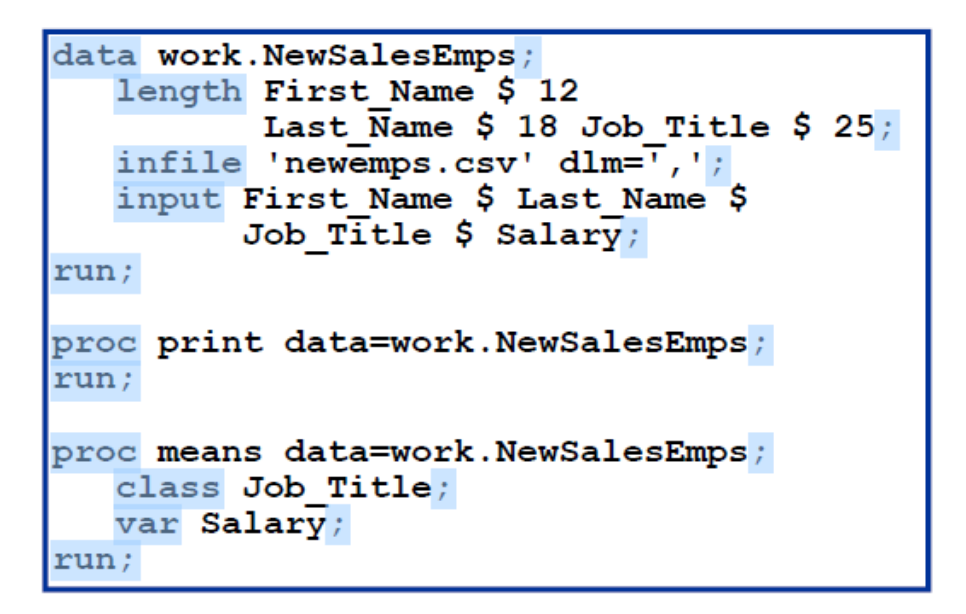
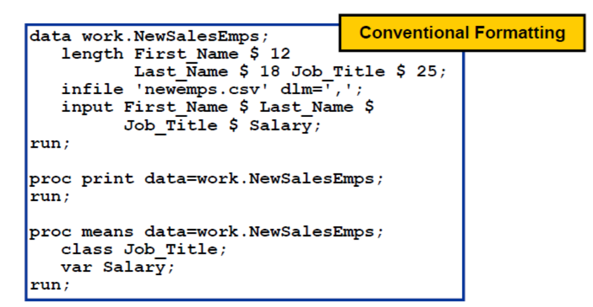
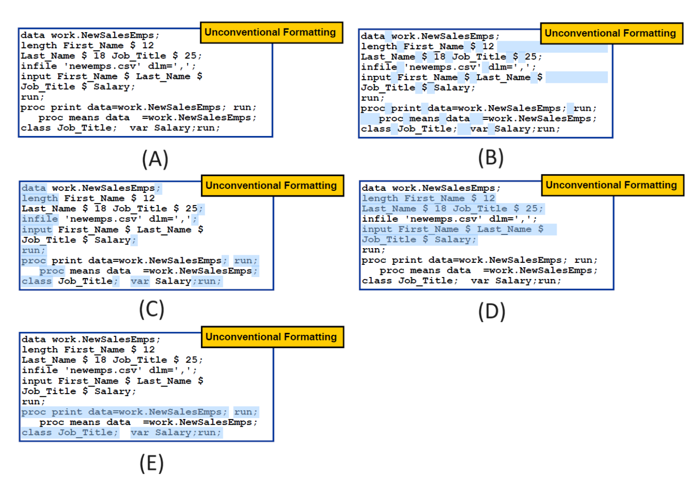

# Working with SAS Syntax

Objective

1.  Identify the characteristics of SAS statements.
2.  Explain SAS syntax rules.
3.  Insert SAS comments using two methods.
4.  Identify SAS syntax errors.
5.  Diagnose and correct a program with errors.
6.  Save the corrected program

In general, writing a SAS program is to write a sequence of steps, and a step is a sequence of SAS statements:

::: callout-exercise
Exercise 2-1: How many statements are in the following step?
:::

## SAS Statments

SAS statements have these characteristics (Check the highlight context in the following examples):

-   Usually begin with an identifying keyword.
-   Always end with a semicolon.



SAS programming statements are easier to read if you begin DATA, PROC, and RUN statements in column one and indent the other statements. This makes it more structured. Also, consistent spacing also makes a SAS program easier to read.



Overall, we can type SAS statements in the following ways:

-   One or more blanks can be used to separate words.
-   They can begin and end in any column.
-   A single statement can span multiple lines.
-   Several statements can be on the same line.



Sometimes we may want to make comments/notes to easy remember our SAS statements or to let other people easily understand what our code want to say. These comments are text that SAS ignores during processing. You can use comments anywhere in a SAS program to document the purpose of the program, explain segments of the program, or mark SAS code as non-executing text.

There are two ways to insert comments in a SAS program:

1.  Using an asterisk (\*) to begin the comment and a semicolon (;) to end the comment.

``` r
* This is a comment in SAS;
```

2.  Using slash-asterisk (/*) to begin the comment and asterisk-slash (*/) to end the comment.

``` r
/* This is a comment in SAS */
```

Avoid placing the /\* comment symbols in columns 1 and 2. On some operating environments, SAS might interpret these symbols as a request to end the SAS job or session. An example is given below:

## Diagnosing and Correcting Syntax Errors

Syntax errors occur when program statements do not conform to the rules of the SAS language.

Examples of syntax errors:

-   misspelled keywords
-   unmatched quotation marks
-   missing semicolons
