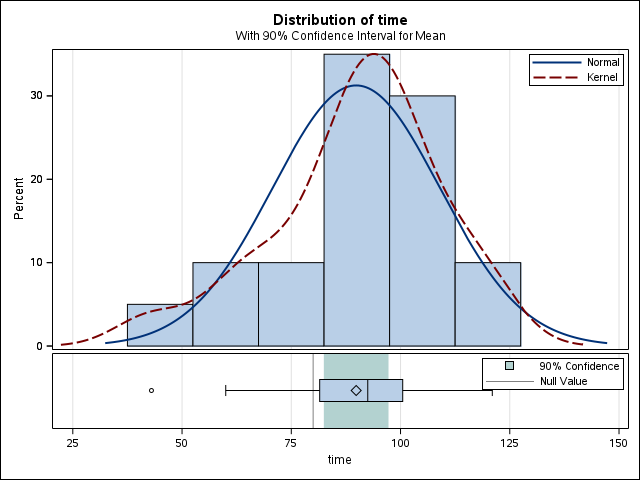
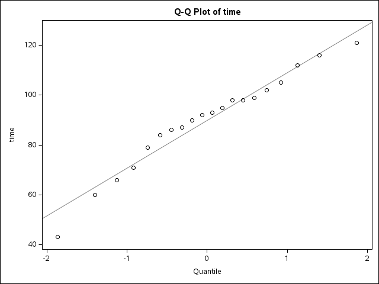
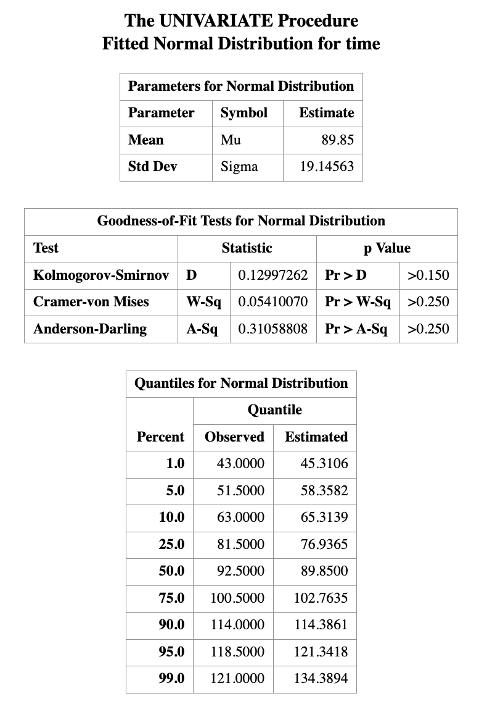

# Introduction to Statistical Inference II

> Learning Objectives
>
> 1.  Distinguish between a *probability problem* and a *statistical (inference) problem*
> 2.  Apply the *one-sample* $t$ test to inference for a population mean
> 3.  Conduct *model diagnostics* for the normality assumption
> 4.  Correctly *interpret point estimates, confidence intervals, and hypothesis tests*

## 1. Recall: One-Sample Mean Problem

In the previous class, we studied inference for a *population mean* and show how to run SAS to obtain the statistical inference result from one sample $t$ test. The example for illusrtratioe is to study the mean length of a certain type of the court case, i.e., $$
\mu = \text{the mean length of a certain type of court case}.
$$ The data for the study is

$$
43,\; 90,\; 84,\; 87,\; 116,\; 95,\; 86,\; 99,\; 93,\; 92,
$$ $$
121,\; 71,\; 66,\; 98,\; 79,\; 102,\; 60,\; 112,\; 105,\; 98.
$$ and we implement the statistical model: $$
X_i \stackrel{\text{i.i.d.}}{\sim} N(\mu, \sigma^2),
\qquad i = 1, \ldots, 20.
$$

With this set up, we can use SAS, such as through the following code

``` r
ODS GRAPHICS ON;

PROC TTEST H0=80 PLOTS(SHOWH0) SIDES=U ALPHA=0.1;
  VAR TIME;
RUN;

ODS GRAPHICS OFF;
```

and obtain the statistical results. The results let us know

-   A point estimate of $\mu$
-   An interval estimate of $\mu$
-   A hypothesis testing under $H_0:\mu=80$ versus $H_1$,

from $t$-distribution for the one sample mean problem.

From the example, we may think the beginning of conducting statistical analysis procedure as

i.  Formulate the statistical problem

ii. Collection the adequate dataset and think the dataset as realization of some random variables

iii. Think some statistical models (i.e., assumptions) to be considered for the random variables. This step may include some \[iv\]

iv. preliminary data analysis

In this lecture, we will continue the remaining two steps:

v.  Model diagnostics

<!-- -->

vi. Interpret the results

## Model Diagnostics

In this step, we pause and think carefully about the assumptions underlying our analysis.

**Question:**

> What statistical models are we implementing?

In this course, the key assumptions for the one-sample mean problem are:

-   **A normality assumption**
-   **An independence assumption**

The independence assumption is primarily determined by *how the data are collected*. Once the data have been sampled, this assumption is generally *not testable* from the data alone.\
We therefore assume that the sampling process was conducted correctly and focus our attention on checking the *normality assumption*.

There are two broad classes of methods:

-   *Graphical (visual) diagnostics*
-   *Formal hypothesis testing methods*

### Graphical Diagnostics for Normality

Common graphical tools include:

-   **Histogram and Density Plots**:\
    A kernel density estimate (KDE) provides a smooth estimate of the underlying probability density function, analogous to a histogram but without binning. KDEs represent the data using a continuous curve and are particularly useful for visualizing distributional shape.

-   **Q–Q Plot (Quantile–Quantile Plot)**\
    A Q–Q plot compares *empirical quantiles* of the observed data with *theoretical quantiles* from a normal distribution.\
    If the normality assumption is reasonable, the points should fall approximately along a straight line.





### Formal Hypothesis Testing for Normality

In addition to graphical methods, we can also assess the normality assumption using *formal numerical tests*.\
One commonly used method is the **Kolmogorov–Smirnov (K–S) test**, which evaluates whether a sample plausibly comes from a specified distribution, such as the normal distribution.

The K–S test is widely used because many statistical procedures rely on the assumption that the data are normally distributed. When this assumption is violated, standard inference procedures may no longer be valid. The following step-by-step example demonstrates how to perform a Kolmogorov–Smirnov test for normality using **SAS**.

**Step 1: Create the dataset**

``` r
DATA time;
    INPUT time @@;
    DATALINES;
43 90 84 87 116 95 86 99 93 92
121 71 66 98 79 102 60 112 105 98
;
RUN;
```

**Step 2: Perform the normality test**

``` r
/* Perform Kolmogorov–Smirnov test */
PROC UNIVARIATE DATA=time;
    HISTOGRAM time / NORMAL(mu=est sigma=est);
RUN;
```



::: callout-note
### Remarks

Graphical diagnostics are informal but highly informative.\
They allow us to detect skewness, heavy tails, and outliers that may invalidate normal-based inference.

Formal hypothesis tests for normality will be introduced next, but should always be interpreted in conjunction with these visual tools.
:::

::: {.callout-note title = "Important Note"}

For the best practice:

*Never rely on a single normality test. Always combine numerical tests with visual inspection.*

:::

## Interpretation of Results

### Point Estimation

Point estimation is the process of using sample data to compute a single numerical value that estimates an unknown population parameter, such as the population mean.

When we report a point estimate, it is desirable to understand whether the estimator has good statistical properties. In particular, we often examine whether a point estimator is:

-   **Consistent**: As the sample size increases, the estimator becomes closer to the true parameter value.

-   **Unbiased**: The expected value of the estimator equals the true population parameter. For example, the sample mean is an unbiased estimator of the population mean.

-   **Efficient (or best unbiased)**: Among all unbiased and consistent estimators, it has the smallest variance, meaning the estimator varies less from sample to sample.

How to rigorously verify these properties is a major topic in theoretical statistics courses. In practice, when these properties are unknown or difficult to assess, the safest interpretation of a point estimate is simply to report it with its associated unit. For example, using the court length data, we may state:

> *A reasonable estimate for the average court length is approximately 89.85 days.*

### Confidence Intervals

A confidence interval (CI) provides a range of plausible values for an unknown population parameter. A common—but informal—interpretation of a 95% confidence interval is that we are “95% confident” the true parameter lies within the interval. While this interpretation is widely used, the **strictly correct interpretation** is based on repeated sampling:

> If the same study were repeated infinitely many times, and a 95% confidence interval were constructed each time, then approximately 95% of those intervals would contain the true parameter value.

As an example, suppose the 90% confidence interval for the population mean court length is $[15.2,\; 26.2].$ This means that, under the confidence interval procedure used, intervals constructed in this way would contain the true mean in 90% of repeated samples.

**Factors Affecting Confidence Interval Width**

The width of a confidence interval depends on several factors:

-   **Sample size**\
    Larger samples typically produce narrower (more precise) confidence intervals.

-   **Variability of the outcome**\
    For continuous outcomes, higher variability (larger standard deviation) leads to wider intervals.

-   **Outcome type**

    -   For binary outcomes, precision depends on the event probability.
    -   For time-to-event outcomes, precision depends on the number of observed events.

All of these factors influence the standard error of the estimator, which directly determines the width of the confidence interval.

### Hypothesis Testing

**Hypothesis testing** evaluates whether observed data are consistent with a specified statistical assumption, typically called the **null hypothesis**.

The result of a hypothesis test allows us to decide whether the assumption is supported by the data or whether there is sufficient evidence to reject it. The strength of this evidence is quantified by the *p-value*.

A **p-value** is defined as:

> The probability of observing data at least as extreme as the data actually observed, assuming the null hypothesis is true.

For example, if a hypothesis test yields a p-value of 0.01, this means that—if the null hypothesis were true—there would be only a 1% chance of observing data this extreme.

A small p-value provides evidence against the null hypothesis, while a large p-value indicates that the data are consistent with it.

If the observed data are very unlikely to occur under the conditions described by the null hypothesis, then the null hypothesis is unlikely to be true. In such cases, we reject the null hypothesis in favor of the alternative hypothesis, and the result is said to be **statistically significant**.

A commonly used decision rule is based on a significance level of 0.05. If the p-value is less than or equal to 0.05, this is typically taken as evidence against the null hypothesis, and we reject it in favor of the alternative hypothesis. However, a p-value cannot be used to prove that a hypothesis is true. Instead, it quantifies the strength of evidence against the null hypothesis.

::: {.callout-example title="(Continue) Court Case Length"}
Consider the court length data. Suppose we conduct a hypothesis test with $$
H_0: \mu = 80 
\quad \text{versus} \quad 
H_1: \mu > 80,
$$ and obtain a p-value of 0.0164.

If we choose a significance level of 0.05, then since $0.0164 < 0.05,$

we reject the null hypothesis. At the 5% significance level, there is strong statistical evidence that the population mean court length is **not equal to 80**.

**When the p-value Is Large**

If the p-value is greater than 0.05, we **do not reject** the null hypothesis. This does **not** mean that the null hypothesis is true. Rather, it means that the data do not provide strong enough evidence to conclude that the population mean court length differs from 80.

In hypothesis testing, failing to reject the null hypothesis should be interpreted as *insufficient evidence*, not as confirmation of the null hypothesis.
:::
