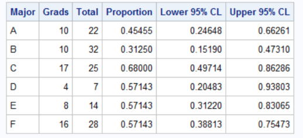
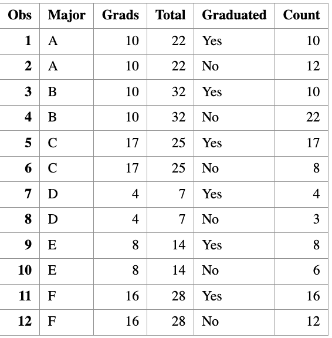
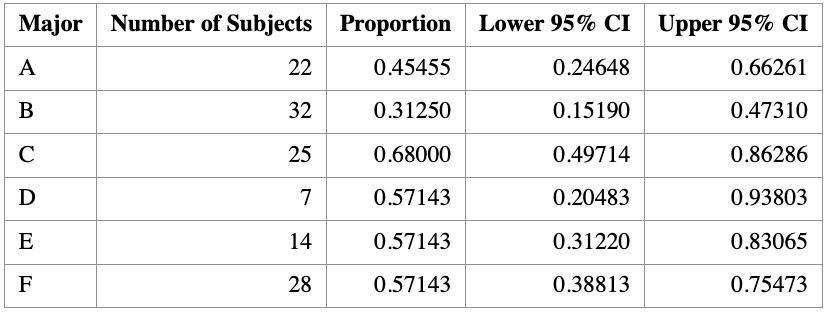
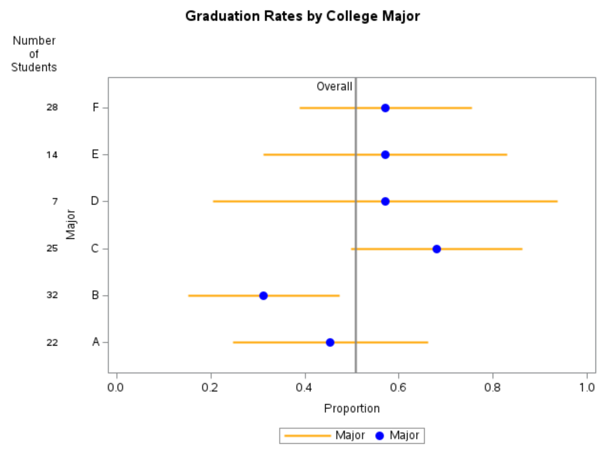

# One Sample Proportion Test


> Learning Objectives
>
> 1. Apply the binomial test to conduct statistical inference for a population proportion.


## Motivation

Suppose we observe a **categorical variable with two levels**, such as

- `SMOKES = 1`: smoker  
- `SMOKES = 2`: non-smoker  

In this setting, we are often interested in making inference about the **population proportion** of interest, such as the proportion of people who smoke.

We denote this population proportion by $p$.

Common inferential goals include:

- Estimating the population proportion $p$
- Constructing a confidence interval for $p$
- Performing a hypothesis test for $p$

Specifically, we may test

$$
\begin{aligned}
H_0 &: p = p_0, \\[0.5em]
H_1 &: 
\begin{cases}
p \neq p_0, & \text{(two-sided)},\\
p < p_0,    & \text{(left-sided)},\\
p > p_0,    & \text{(right-sided)}.
\end{cases}
\end{aligned}
$$


### Sampling Distribution of the Sample Proportion

Let $\hat{p}$ denote the **sample proportion**, computed as

$$
\hat{p} = \frac{X}{n},
$$

where

- $X$ is the number of successes,
- $n$ is the sample size.

When the sample size is sufficiently large (typically $n \ge 30$), the sampling distribution of
$\hat{p}$ is approximately normal:

$$
\hat{p} \sim N\left(p, \frac{p(1-p)}{n}\right).
$$

This normal approximation forms the basis for both **confidence intervals** and **hypothesis testing**
for a population proportion.

### Confidence Interval for a Proportion

A $(1-\alpha)\times 100\%$ confidence interval for $p$ is given by

$$
\left[
\hat{p} - Z_{\alpha/2}\sqrt{\frac{\hat{p}(1-\hat{p})}{n}},
\quad
\hat{p} + Z_{\alpha/2}\sqrt{\frac{\hat{p}(1-\hat{p})}{n}}
\right].
$$

Here, $Z_{\alpha/2}$ is the standard normal quantile satisfying

$$
P(Z \ge Z_{\alpha/2}) = \alpha/2, \quad Z \sim N(0,1).
$$
Moreover, this normal approximation of $\hat{p}$ is also used to perform hypothesis testing for $p$.

### Standard Error of the Sample Proportion

The **standard error** of $\hat{p}$ is

$$
\text{SD}(\hat{p}) = \sqrt{\frac{\hat{p}(1-\hat{p})}{n}}.
$$

This expression highlights an important principle:

> The uncertainty in an estimate decreases as the sample size increases.


### Interpretation: Effect of Sample Size

Consider two examples where the estimated proportion is the same.

::: {.callout-example title = "College"}

A small college has 8 physics majors, and 5 of them graduate within four years.

$$
\hat{p} = \frac{5}{8} = 0.625
$$

The standard error is

$$
\text{SE}(\hat{p}) = \sqrt{\frac{0.6 \times 0.4}{8}} \approx 0.17.
$$


An English department graduates 50 out of 80 students.

$$
\hat{p} = \frac{50}{80} = 0.625
$$

The standard error is

$$
\text{SE}(\hat{p}) = \sqrt{\frac{0.6 \times 0.4}{80}} \approx 0.05.
$$

Does this make sense?

:::


::: {.callout-note title = "Note"}

In practice, when the normal approximation may not be reliable (e.g., small $n$),
we will instead rely on **exact binomial methods**, which do not require large-sample assumptions.

:::

## Computation

Suppose a college has six majors, labelled A, B, C, D, E, and F.
For each major, we observe:
	+ the number of students who graduated within four years (Grads), and
	+ the total number of students in that major (Total).
	
``` r
DATA Grads;
  INPUT Major $ Grads Total @@;
  DATALINES;
A 10 22  B 10 32  C 17 25
D  4  7  E  8 14  F 16 28
;
RUN;
```

{width=50%}


It is easy to write a short DATA step to compute the empirical proportions and a 95% confidence
interval for each major.

``` r
DATA GradRate;
  SET Grads;

  /* Empirical proportion */
  p = Grads / Total;

  /* Standard error under normal approximation */
  StdErr = SQRT(p * (1 - p) / Total);

  /* 95% Wald confidence interval */
  z = QUANTILE("normal", 1 - 0.05/2);

  LCL = MAX(0, p - z * StdErr);   /* Lower bound */
  UCL = MIN(1, p + z * StdErr);   /* Upper bound */

  LABEL p   = "Proportion"
        LCL = "Lower 95% CI"
        UCL = "Upper 95% CI";
RUN;
```



The output shows that although majors D, E, and F have the same four-year graduation rate (57%), the estimate for the D group, which has only seven students, has twice as much variability as the estimate for the F group, which has four times as many students.

## Automating the Computations with PROC FREQ

In the previous section, we computed the Wald confidence interval for each major using a DATA step. That approach is straightforward, but it becomes inconvenient if we want other binomial confidence intervals (e.g., exact/Clopper–Pearson, Wilson, etc.). A convenient alternative is to use `PROC FREQ` with the `BINOMIAL` option. However, PROC FREQ expects the data in an event / nonevent format (a binary outcome with a frequency count), rather than the events / trials format (Grads, Total) we currently have.

So we first convert each major into two rows:
	+ Graduated="Yes" with Count = Grads
	+ Graduated="No" with Count = Total - Grads


Step 1: Convert events/trials into event/nonevent format

``` r
/*--------------------------------------------------------------
  Convert Event/Trials format (Grads, Total)
  into Event/Nonevent format (Graduated, Count)
--------------------------------------------------------------*/
data GradFreq;
  set Grads;

  Graduated = "Yes"; 
  Count = Grads;
  output;

  Graduated = "No";
  Count = Total - Grads;
  output;
run;

proc print data=GradFreq;
run;
```

{width=50%}


Step 2: Run PROC FREQ to compute binomial CIs by major

``` r
/*--------------------------------------------------------------
  Use PROC FREQ to analyze each major separately and compute
  binomial confidence intervals for Pr(Graduated="Yes")
--------------------------------------------------------------*/
proc freq data=GradFreq noprint;
  by notsorted Major;

  tables Graduated / binomial(level="Yes" CL=wald);
  weight Count;

  output out=FreqOut binomial;
run;
```

Step 3: Print a clean summary table

``` r 
proc print data=FreqOut noobs label;
  var Major N _BIN_ L_BIN U_BIN;

  label _BIN_ = "Proportion"
        L_BIN = "Lower 95% CI"
        U_BIN = "Upper 95% CI";
run;
```



## Visualization of Binomial Proportion


It is often helpful to visualize estimated proportions together with their confidence intervals.  
When plotting several proportions on the same graph, it is a good idea to **sort the groups** in a meaningful way—most commonly by the estimated proportion itself. If two groups have the same estimated proportion, the sample size can be used as a tie-breaker.

### Why visualization matters

A single number rarely tells the whole story. Plotting proportions with confidence intervals allows us to:

- Compare graduation rates across majors at a glance
- Assess uncertainty in each estimate
- See how sample size affects precision

Groups with **smaller sample sizes** tend to have **wider confidence intervals**, reflecting greater uncertainty.

### Adding a reference line

It is often informative to add a **reference line** representing the **overall proportion**, regardless of group membership.

For the graduation data in this example, the overall proportion of students who graduate in four years is

$$
\hat p_{\text{overall}} = \frac{65}{128} \approx 0.5078.
$$

This reference line helps contextualize each major’s graduation rate relative to the overall average.

> **Tip:**  
> You can obtain the overall proportion in SAS by repeating the `PROC FREQ` analysis **without** a `BY` statement.

### Including sample size on the plot

Because uncertainty depends strongly on sample size, it is good practice to display the **number of observations per group** directly on the graph.

In SAS, this can be done using the `YAXISTABLE` statement, which adds a table aligned with the y-axis showing the sample size for each group.

### Interpreting the plot

A typical plot of binomial proportions with confidence intervals shows:

- **Points**: estimated proportions  
- **Error bars**: 95% confidence intervals  
- **Vertical reference line**: overall proportion  
- **Table entries**: number of students in each major  

Such a graph clearly illustrates that majors with fewer students (for example, very small departments) have much wider confidence intervals than majors with larger enrollments.

### Practical visualization advice

- If there are **10 or more categories**, consider using **alternating background color bands** to make it easier to associate confidence intervals with groups.
- Always label axes clearly (e.g., *Proportion* on the x-axis).
- Include the confidence level (e.g., “95% CI”) in the caption or title.




### Summary

This section demonstrates how visualization complements numerical output:

- `PROC FREQ` provides estimated proportions and confidence intervals.
- Graphing proportions with confidence intervals makes comparisons intuitive.
- Including sample sizes helps readers understand why some intervals are wider than others.

Well-designed graphics are one of the most effective ways to communicate results from binomial proportion analyses.

