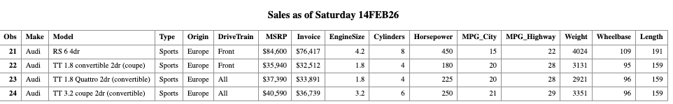
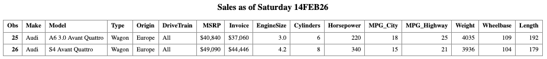
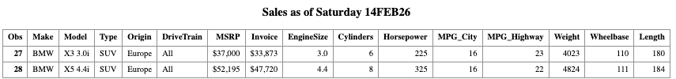
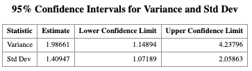
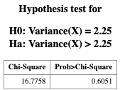
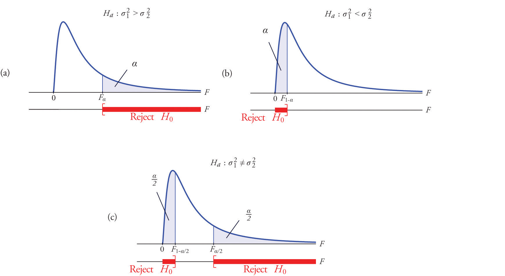

# SAS Macro Program in One Sample Variance Problem

> Learning Objectives
>
> 1. Apply hypothesis testing and confidence interval construction for **one population variance**.
> 2. Use this example to motivate **writing reusable SAS macro programs**.

## Motivation

In many applications, we may care more about the **population variance** $\sigma^2$ than the population mean $\mu$. For instance, in a manufacturing process, a **large variance** in product measurements indicates unstable quality, even if the mean is acceptable. This is not the only instance, as there are many interesting scientific questions that involve the population variance both in academia and in industry.

### Examples

::: {.callout-example title="SCUBA Diving"}

  A SCUBA instructor records the dive depths of students during checkout.
  Although everyone should be at the same depth, the instructor is interested
  in how much the depths vary.

  The instructor believes the standard deviation is **3 feet**, while the assistant
  thinks it is **less than 3 feet**.

  The hypotheses are:

  $$
  H_0 : \sigma^2 = 3^2
  \qquad \text{vs} \qquad
  H_1 : \sigma^2 < 3^2
  $$
  
:::

::: {.callout-example title = "Manufacturing Quality"}

  A company produces metal pipes of a standard length.
  Twenty years ago, the pipe lengths were normally distributed with
  standard deviation **1.1 cm**.

  The company now tests a random sample of **30 pipes** and wants to construct
  a **95% confidence interval** for $\sigma^2$ to determine whether the production
  quality has changed.

:::

For the examples above, the quantity of the interest is the population variance. But we need something to estiamte it. Let $s^2$ denote the sample variance. Then the pivotal quantity

$$
\frac{(n-1)s^2}{\sigma^2},
$$

which follows a chi-square distribution:

$$
\frac{(n-1)s^2}{\sigma^2} \sim \chi^2_{n-1},
$$
where 

- $n$ : sample size  
- $s^2$ : sample variance  
- $\sigma^2$ : population variance  

You may think that $s$ as the randomvariable in this test. The distribution is called chi-square distribution which depends on a parameter named the *degrees of freedom* denoted by $\mathrm{df}=n-1$. A test of a single variance may be right-tailed, left-tailed or two-sided. This chi-square result is the foundation for both
**confidence intervals** and **hypothesis tests** for $\sigma^2$.

::: {.callout-note title="Note"}

A $(1-\alpha)\times 100\%$ confidence interval for the population variance is

$$
\left(
\frac{(n-1)s^2}{\chi^2_{1-\alpha/2,\;n-1}},
\;
\frac{(n-1)s^2}{\chi^2_{\alpha/2,\;n-1}}
\right),
$$

where $\chi^2_{p,\;n-1}$ denotes the $p$-th quantile of the
$\chi^2_{n-1}$ distribution.

I won't expect you to know the expression here for now.

:::

> **Problem**
>
> Unfortunately, if you check the built-in SAS procedures, you will find that **there is no basic procedure** that directly handles the **one-sample variance inference problem**.
> 
> The good news is that SAS provides a powerful **MACRO programming language**, which allows us to **write our own SAS procedures**.
>


## SAS Macro Program

When you write a program that will be run **repeatedly**, you may want to seriously consider using **macros**, because:

- **MARCROS allow centralized changes**:  
  You can make a change in one location, and SAS will cascade that change throughout your program.

- **MACROS promote code reuse**:  
  You can write a section of code once and reuse it many times, either within the same program or across different programs.

- **MARCROS enable data-driven programming**:  
  SAS can decide what actions to take based on actual data values.

In general, macro code takes **longer to write and debug** than standard SAS code. Therefore, macros are usually **not recommended** for programs that will only be run a few times.

However, if you find yourself writing **similar code repeatedly**, macros can significantly improve efficiency and reduce errors.


Macros can help in several ways:

1. You can make a **single small change**, and SAS will propagate that change throughout your program.
2. You can **reuse code blocks**, avoiding duplication.
3. You can build **data-driven programs**, allowing SAS to adapt automatically to different datasets or inputs.

## How Macros Work

When you submit a standard SAS program, SAS **compiles and executes it immediately**. When you write macro code, there is an **additional step**:

- SAS first sends MARCO statements to the **macro processor**.
- The macro processor **resolves the macro code**, generating standard SAS code.
- SAS then compiles and executes the generated code.

Because you are writing a program that **writes another program**, this process is sometimes referred to as **meta-programming**.

## Designing Your Own Macros

To design effective SAS macros, we need to understand two fundamental concepts:

### Macros vs. Macro Variables

As you construct macro programs, you will work with two basic building blocks:

- **MACROS** v.s.
- **MACRO variables**

To design your own SAS macros, we need to clearly distinguish between **macros** and **macro variables**. These are the two basic building blocks of SAS macro programming.

Conceptually, the workflow looks like this:

- You write **macro code**
- The **macro processor** resolves it
- The output is **ordinary SAS code**, which is then compiled and executed


**Naming Conventions**

You can tell macros and macro variables apart by their prefixes:

- **Macro variables** start with an ampersand: `&`
- **Macros** start with a percent sign: `%`

Examples:
- `&alpha`, `&n`
- `%myMacro`, `%DO`, `%IF`

**Macro Variables**

A **macro variable** is similar to a data variable, but with important differences:

- It does **not belong to a dataset**
- It has **only one value**
- That value is **always character**
- The value is **substituted directly into your program**

A macro variable’s value can be:
- A variable name
- A number
- Text
- Any string you want substituted into your SAS code

**Macro**

A **macro** is a larger unit of code that can contain:

- DATA steps
- PROC steps
- Macro logic such as  
  `%IF–%THEN–%ELSE`, `%DO–%END`

Macros often—but not always—use macro variables.

## Think Globally and Locally: Scope of Macro Variables

Macro variables come in two scopes:

- **Local macro variables**
- **Global macro variables**

### Local Macro Variables
- Defined **inside a macro**
- Exist **only within that macro**
- Cannot be referenced outside the macro

### Global Macro Variables
- Defined in **open code** (outside any macro)
- Can be used **anywhere in the program**

### Common Mistakes to Avoid
- Using a local macro variable outside its macro
- Accidentally creating **both local and global macro variables with the same name**

Keeping scope in mind will save you a lot of debugging time.


::: {.callout-note}

The macro processor **does not resolve macro references inside single quotes**.

- ❌ `'&var'` → macro not resolved
- ✅ `"&var"` → macro resolved

**Rule of thumb:**  

> Use **double quotes** when quoted strings contain macro variables.

:::


**Substituting Text with `%LET`**

The `%LET` statement assigns a value to a macro variable.

```r
%LET alpha = 0.05;

%MACRO macro_name(param1, param2, ..., paramk);
   /* macro code */
%MEND macro_name;

```

## Writing SAS Macros with Car dataset

Before writing our own macros, let us first understand how **macro variables** work through a simple example.

::: {.callout-example title = "Car Dataset"}

SAS provides a built-in **global macro variable** called `SYSDATE`, which represents the system date.

Suppose we want to print the system date automatically in the title of a SAS report every time the report is generated. The advantage is that we do **not** need to manually update the date in the code. We use the built-in SAS dataset `CARS` from the `SASHELP` library.

``` r
PROC PRINT DATA=SASHELP.CARS;
  WHERE MAKE = 'Audi' AND TYPE = 'Sports';
  TITLE "Sales as of &SYSDAY &SYSDATE";
RUN;
```



So far, we have used macro variables to make our SAS programs more flexible.  
Now we take one more step forward and define a **macro program**, which is a reusable block of SAS code. Macro variables are referenced in SAS statements using the ampersand (&) character.

Now suppose we want our program to be more flexible. Instead of hard-coding the car MAKE and TYPE, we define macro variables so that we can easily change them without modifying multiple lines of code.


``` r
%LET MAKE_NAME = Audi;
%LET TYPE_NAME = Sports;

PROC PRINT DATA=SASHELP.CARS;
  WHERE MAKE = "&MAKE_NAME" AND TYPE = "&TYPE_NAME";
  TITLE "Sales as of &SYSDAY &SYSDATE";
RUN;
```


Reusing the Same Program with Different Values

Now, suppose we want to view Audi vehicles of type Wagon.
We only need to change one line of code.

``` r
/* Change only the macro variable values */
%LET MAKE_NAME = 'Audi';
%LET TYPE_NAME = 'Wagon';

/* The SAS code below remains unchanged */
PROC PRINT DATA = SASHELP.CARS;
    WHERE MAKE = &MAKE_NAME AND TYPE = &TYPE_NAME;
    TITLE "Sales as of &SYSDAY &SYSDATE";
RUN;
```



**More on Macro program**

The following program defines a macro called `show_result`.  
This macro takes two arguments:

- `make_`: the car manufacturer
- `type_`: the vehicle type

```r
%MACRO show_result(make_, type_);

PROC PRINT DATA=SASHELP.CARS;
  WHERE MAKE = "&make_" AND TYPE = "&type_";
  TITLE "Sales as of &SYSDAY &SYSDATE";
RUN;

%MEND;
```

Calling a Macro
Once a macro is defined, it can be called just like a function.

``` r
%show_result(BMW, SUV);
```



:::


So after seeing the first example, we have a more clear sense about why Use Macro Programs?

Macro programs allow you to:

+ Avoid rewriting the same code repeatedly
+ Centralize logic in one place
+ Make programs easier to maintain and extend
+ Write data-driven and parameterized SAS programs

This idea becomes especially powerful when we need to repeat the same analysis for many datasets or parameter values.


## Revisit the One-Sample Variance Test


As discussed earlier, SAS does NOT provide a built-in procedure for conducting
one-sample variance inference (confidence intervals or hypothesis tests). However, SAS allows us to overcome this limitation by writing our own macro procedures. Fortunately, a one-sample variance inference macro is commonly used and can be written in a general form. In this course, we will use a macro named `vartest.sas`, which is shared in the iCollege and below.

``` r
%macro vartest(version,
                 data= _last_  ,
                 var=         ,
                 alpha=  0.05   ,
                 var0=,
                 sigma0=
              );

%if &version ne %then %put VARTEST macro Version 1.1;
%let opts = %sysfunc(getoption(notes))
            _last_=%sysfunc(getoption(_last_));
%if &data=_last_ %then %let data=&syslast;
options nonotes;

%if &sigma0=0 or &var0=0 %then %do;
  %put ERROR: The null hypothesis variance (VAR0=) or standard deviation;
  %put %str(      ) (SIGMA0=) must be greater than zero.;
  %goto exit;
%end;

proc summary data=&data;
  var &var;
  output out=_varn(keep=var n std) n=n var=var std=std;
run;

data _vartest;
  set _varn;
  df=n-1;
  %if &sigma0 ne %then %str(nullvar=&sigma0 * &sigma0;);
  %if &var0 ne %then %str(nullvar=&var0;);
  level=(1-&alpha)*100;
  call symput('level',trim(left(level)));
  %if &sigma0 ne or &var0 ne %then %do;
    chisq=((df)*(var))/nullvar;
    pvalue=1-probchi(chisq,df);
  %end;
  uclvar=df*var/cinv(&alpha/2,df); uclstd=sqrt(uclvar);
  lclvar=df*var/cinv(1-&alpha/2,df); lclstd=sqrt(lclvar);
  label var="Sample Variance" std="Sample Std Dev" 
        chisq="Chi-Square" pvalue="Prob>Chi-Square"
        level="Confidence Level (%)"
        uclvar="UCL for Variance" lclvar="LCL for Variance"
        uclstd="UCL for Std Dev" lclstd="LCL for Std Dev";
  drop df  %if &sigma0 ne or &var0 ne %then nullvar;  ;
run;

data _ci;
  set _vartest;
  stat="Variance"; estimate=var; lcl=lclvar; ucl=uclvar; output;
  stat="Std Dev";  estimate=std; lcl=lclstd; ucl=uclstd; output;
  label stat="Statistic"
        estimate="Estimate"
        lcl="Lower Confidence Limit"
        ucl="Upper Confidence Limit";
  run;

proc print data=_ci label noobs;
  var stat estimate lcl ucl;
  title "&level.% Confidence Intervals for Variance and Std Dev";
  run;

%if &sigma0 ne or &var0 ne %then %do;
proc print data=_vartest label noobs;
  var chisq pvalue;
  format pvalue 6.4;
  title  "Hypothesis test for";
  title2;
 %if &var0 ne %then %do;
  title3 "H0: Variance(%upcase(&var)) = &var0";
  title4 "Ha: Variance(%upcase(&var)) > &var0";
 %end;
 %if &sigma0 ne %then %do;
  title3 "H0: StdDev(%upcase(&var)) = &sigma0";
  title4 "Ha: StdDev(%upcase(&var)) > &sigma0";
 %end;
run;
%end;

%exit:
title;
options &opts;
%mend;
```	

With this Marcro, we can implement it to construct the hypothesis testing or confidence interval for population variance $\sigma^2$. 

::: {.callout-example title = "One-Sample Variance Test"}

``` r
/* Create a sample data set */
DATA DAT;
    INPUT X @@;
    DATALINES;
6.2 1.9 4.4 4.9 3.5
4.6 4.2 1.1 1.3 4.8
4.1 3.7 2.5 3.7 4.2
1.4 3.2 2.6 1.5 3.9
;
RUN;

/* Display the data */
PROC PRINT DATA = DAT;
RUN;
```

This dataset includes **20 measurements** of the length of a product from a manufacturing process. Again, our goal is to conduct **statistical inference on the population variance** of the product length. Specifically, we want to test whether the population variance is **greater than 2.25**.


``` r
DATA DAT;
    INPUT X @@;
    DATALINES;
6.2 1.9 4.4 4.9 3.5
4.6 4.2 1.1 1.3 4.8
4.1 3.7 2.5 3.7 4.2
1.4 3.2 2.6 1.5 3.9
;
RUN;

PROC PRINT DATA = DAT;
RUN;
```

### Using the `VARTST` Macro in SAS

Once the dataset has been created in SAS and the macro has been saved in a file with a known path, we can use the following code to conduct the **one-sample variance test** and construct the corresponding **confidence intervals**.


Use the `%INCLUDE` statement to load the macro into your SAS session:

``` r

/* When using SAS Windows */ 
%INCLUDE 
"C:/Users/cyeh/Desktop/Teaching/GSU/STAT8678-SAS/code/L10/vartest.sas";

/* in SAS studio */ 
%INCLUDE
"/home/u64378616/chikuang/Part2/L10_Marco/vartest.sas";

%VARTST(
    DATA  = DAT,
    VAR   = X,
    ALPHA = 0.05,
    VAR0  = 2.25
);

```





:::

Question for you: 

> How would you modify the macro call if you want to test whether the population standard deviation is greater than 1.5 instead of testing the population variance?


::: {.callout-note title = "Answer with Explanation"}

To calculate the p-value for $H_1:\sigma^2 < \sigma_0^2$ and $H_1:\sigma^2\ne \sigma_0^2$ from the p-value for $H_1: \sigma^2 > \sigma_0^2$. We can do the following:

Let $p$ be the p-value for the right-tailed test $H_1: \sigma^2 > \sigma_0^2$.

+ For the left-tailed test $H_1: \sigma^2 < \sigma_0^2$, the p-value is $1-p$.
+ For the two-sided test $H_1: \sigma^2 \ne \sigma_0^2$, the p-value is $\min\{p, 1-p\} \times 2$.



:::