# $\chi^2$ Goodness of Fit Test

> Learning Objectives
>
> 1. Explain what is a diagnostic test.
> 2. Explain what is a one-way contingency table. 
> 3. Apply the diagnostic test to perform inference for analyzing a one-way contingency table.

## Motivation: What Is a Goodness-of-Fit Test?

A **goodness-of-fit test**, in general, refers to measuring how well the observed data correspond to a fitted (assumed) model.

We will use this concept throughout the course as a way of checking model fit.\
Similar to linear regression, in essence, a goodness-of-fit test compares:

-   **Observed values**, and\
-   **Expected (fitted or predicted) values** under a specified model.

**Hypotheses for a Goodness-of-Fit Test**

A goodness-of-fit test examines the following hypotheses:

$$
H_0 : \text{the model } M_0 \text{ fits}
$$

versus

$$
H_1 : \text{the model } M_0 \text{ does not fit}.
$$

## Example: Categorical Data (Dice Example)

Consider the simplest example of a goodness-of-fit test with **categorical data**.

Suppose we want to test whether a fair six-sided die has **equal probability** for each face.\
We compare the observed frequencies to those expected under the assumed model:

$$
X \sim \text{Multinomial}\left(n = 30,\; \pi_0 = \left(\tfrac{1}{6}, \tfrac{1}{6}, \tfrac{1}{6}, \tfrac{1}{6}, \tfrac{1}{6}, \tfrac{1}{6}\right)\right).
$$

In this setting, the goodness-of-fit test asks whether the probability in each cell is equal to the specified value $\pi_0$.

## Hypotheses in Probability Vector Form

The hypotheses can be written as:

$$
H_0 : \boldsymbol{\pi} = \boldsymbol{\pi}_0
$$

versus

$$
H_1 : \boldsymbol{\pi} \neq \boldsymbol{\pi}_0.
$$

## One-Way Contingency Table

In such problems, the data can be summarized using a **one-way contingency table**:

| Categories             | 1     | 2     | 3     | 4     | 5     | 6     |
|------------------------|-------|-------|-------|-------|-------|-------|
| Number of Observations | $O_1$ | $O_2$ | $O_3$ | $O_4$ | $O_5$ | $O_6$ |

Here,

-   $O_1, O_2, \dots, O_6$ are **observed counts** from your dataset.
-   The expected counts are computed from the assumed probability model.

These observed and expected counts form the basis of the $\chi^2$ goodness-of-fit test.

## One-Way Contingency Table and Model Fit

| Categories             | 1            | 2     | 3     | 4     | 5     | 6     |
|------------------------|--------------|-------|-------|-------|-------|-------|
| Number of Observations | $O_1$        | $O_2$ | $O_3$ | $O_4$ | $O_5$ | $O_6$ |
| Expected Observations  | $n\pi_1 = 5$ | $5$   | $5$   | $5$   | $5$   | $5$   |

In the setting of one-way contingency tables, we measure how well an observed variable $X$ corresponds to a model specified by a vector of cell probabilities.

In other words, under the null hypothesis, we assume the data come from a particular distribution, and we test whether this assumed model fits the data well when compared with the **saturated model** (the model that fits the data perfectly).

The rationale behind model fitting is the assumption that a complex data-generating mechanism can be reasonably approximated by a simpler model. The goodness-of-fit test is applied to assess whether this assumption is supported by the data.

## Test Statistics

There are two commonly used test statistics for the $\chi^2$ goodness-of-fit test.

**Pearson Goodness-of-Fit Test Statistic**

The Pearson goodness-of-fit statistic is defined as

$$
X^2 = \sum_{j=1}^{k} \frac{(X_j - n\pi_{0j})^2}{n\pi_{0j}}.
$$

An easy way to remember this formula is

$$
X^2 = \sum_{j=1}^{k} \frac{(O_j - E_j)^2}{E_j},
$$

where

-   $O_j = X_j$ is the observed count in cell $j$, and\
-   $E_j = \mathbb{E}(X_j) = n\pi_{0j}$ is the expected count in cell $j$ under the null hypothesis.

### 1.2 Deviance Test Statistic

The deviance statistic is defined as

$$
G^2
= 2 \sum_{j=1}^{k} X_j \log\!\left(\frac{X_j}{n\pi_{0j}}\right)
= 2 \sum_{j=1}^{k} O_j \log\!\left(\frac{O_j}{E_j}\right).
$$

In some texts, $G^2$ is also referred to as the **likelihood ratio test (LRT) statistic**, which compares the log-likelihoods of two models:

-   $L_0$: the reduced model under $H_0$, and\
-   $L_1$: the full (saturated) model under $H_A$.

$$
G^2
=
-2 \log\!\left(\frac{\ell_0}{\ell_1}\right)
=
-2 \left( L_0 - L_1 \right)
$$

Note that $X^2$ and $G^2$ are both functions of the observed data $X$ and a vector of cell probabilities $\pi_0$. For this reason, we will sometimes write them as $X^2(x, \pi_0)$ and $G^2(x, \pi_0)$, respectively. When there is no ambiguity, we will simply use $X^2$ and $G^2$.

We will encounter these statistics repeatedly throughout the course, particularly in the analysis of two-way and $k$-way contingency tables, and when assessing the fit of log-linear and logistic regression models.

## 2. How Do They Work?

Both $X^2$ and $G^2$ measure how closely the assumed model—here, a multinomial model $\text{Mult}(n, \pi_0)$—fits the observed data.

When the null hypothesis $H_0$ is true, both statistics have an approximate chi-square distribution with $k - 1$ degrees of freedom. This allows us to use the chi-square distribution to obtain critical values and $p$-values for hypothesis testing.

-   If the sample proportions $\hat{\pi}_j$ (i.e., the saturated model) are exactly equal to the model probabilities $\pi_{0j}$ for all cells $j = 1, 2, \ldots, k$, then $O_j = E_j$ for all $j$, and both $X^2$ and $G^2$ are equal to zero. In this case, the model fits the data perfectly.

-   If the sample proportions $\hat{\pi}_j$ deviate from the model probabilities $\pi_{0j}$, then both $X^2$ and $G^2$ are positive. Large values of $X^2$ and $G^2$ indicate that the data do not agree well with the assumed model $M_0$.

## Dice Rolls Example

::: {.callout-example title = "Dice Roll"}

Suppose that we roll a die 30 times and observe the following table showing the number of times each face appears.

| Categories | 1 | 2 | 3 | 4 | 5 | 6 |
|------------------|---------|---------|---------|---------|---------|---------|
| Number of Observations | $O_1 = 3$ | $O_2 = 7$ | $O_3 = 5$ | $O_4 = 10$ | $O_5 = 2$ | $O_6 = 3$ |
| Expected Observations |  |  |  |  |  |  |

We want to test the null hypothesis that the die is fair.

Under this hypothesis, $$
X \sim \text{Mult}(n = 30, \pi_0),
$$ where $$
\pi_{0j} = \frac{1}{6}, \quad j = 1, \ldots, 6.
$$

This is our assumed model. Under $H_0$, the expected counts are $$
E_j = \frac{30}{6} = 5 \quad \text{for each cell}.
$$

We now have all the quantities needed to compute the goodness-of-fit statistics.

We now compute the two goodness-of-fit statistics explicitly.

### Pearson chi-square statistic

$$
\begin{aligned}
X^2
&= \frac{(3-5)^2}{5}
 + \frac{(7-5)^2}{5}
 + \frac{(5-5)^2}{5}
 + \frac{(10-5)^2}{5}
 + \frac{(2-5)^2}{5}
 + \frac{(3-5)^2}{5} \\
&= 9.2
\end{aligned}
$$

### Deviance (likelihood-ratio) statistic

$$
\begin{aligned}
G^2
&= 2\Bigg(
3 \log\frac{3}{5}
+ 7 \log\frac{7}{5}
+ 5 \log\frac{5}{5} \\
&\qquad\quad
+ 10 \log\frac{10}{5}
+ 2 \log\frac{2}{5}
+ 3 \log\frac{3}{5}
\Bigg) \\
&= 8.8
\end{aligned}
$$

Note that although $X^2$ and $G^2$ have the same approximate chi-square distribution, their realized numerical values need not be identical.

The corresponding $p$-values are

$$
P(\chi^2_5 \ge 9.2) = 0.10,
\qquad
P(\chi^2_5 \ge 8.8) = 0.12.
$$

Given a significance level of $\alpha = 0.05$, we **fail to reject** the null hypothesis.

Importantly, failing to reject $H_0$ does **not** mean that the null hypothesis is true. Rather, it means that we do not have sufficient evidence to conclude that it is false.

In this example, the fair-die model does not fit the data exactly, but the lack of fit is not large enough to conclude that the die is unfair at the 5% significance level.

The following SAS code implements the chi-square goodness-of-fit test for the dice example.

**SAS code: Chi-square goodness-of-fit test**

``` r
DATA DIE;
    INPUT FACE $ COUNT;
    DATALINES;
1 3
2 7
3 5
4 10
5 2
6 3
;
RUN;

PROC FREQ DATA=DIE;
    WEIGHT COUNT;
    TABLES FACE / CHISQ;
    /* 
    TABLES FACE / NOCUM ALL 
        CHISQ TESTP=(16.67 16.67 16.67 16.67 16.67 16.67);
    */
RUN;
```

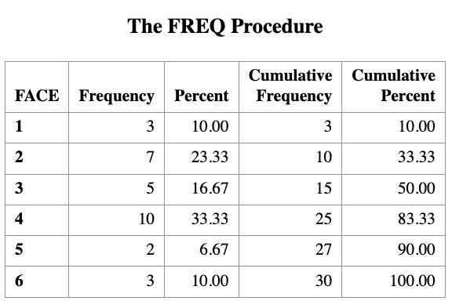 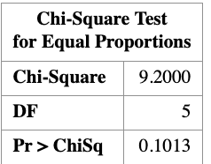

The `PROC FREQ` step computes the Pearson chi-square statistic for testing whether the die is fair. The commented TESTP= option shows how expected probabilities can be specified explicitly.

Computing residuals and goodness-of-fit statistics manually

We now compute Pearson residuals, deviance residuals, and the test statistics $X^2$ and $G^2$ directly from the data.

``` r
DATA CAL;
    SET DIE;

    PI = 1/6;
    ECOUNT = 30 * PI;

    /* Pearson residual */
    RES = (COUNT - ECOUNT) / SQRT(ECOUNT);

    /* Deviance residual */
    DEVRES = SQRT(ABS(2 * COUNT * LOG(COUNT / ECOUNT)))
             * SIGN(COUNT - ECOUNT);
RUN;

PROC PRINT DATA=CAL;
RUN;
```

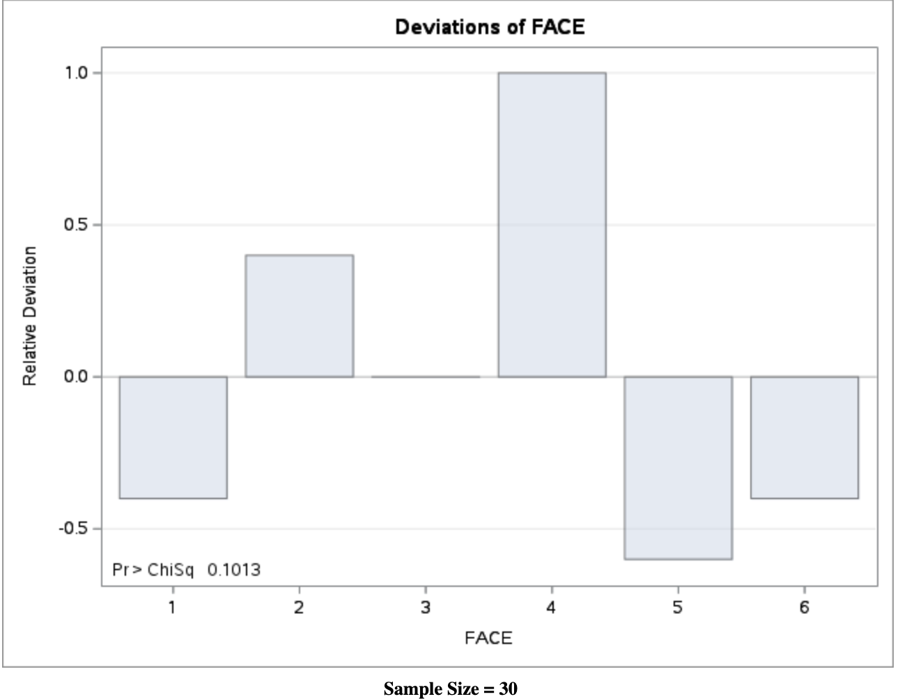 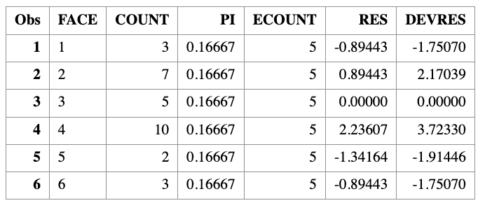

Computing test statistics and $p$-values

``` r
PROC SQL;
    SELECT 
        SUM((COUNT - ECOUNT)**2 / ECOUNT) AS X2,
        1 - PROBCHI(CALCULATED X2, 5)     AS PVALUE_X2,
        2 * SUM(COUNT * LOG(COUNT / ECOUNT)) AS G2,
        1 - PROBCHI(CALCULATED G2, 5)     AS PVALUE_G2
    FROM CAL;
QUIT;
```

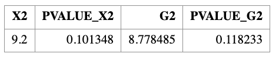

Note that PROC FREQ automatically reports the Pearson chi-square statistic, but does not directly report the deviance statistic. The deviance statistic $G^2$ must be computed manually as shown above.

:::

## Tomato Phenotypes Example

::: {.callout-example title = "Tomato Phenotypes"}

Tall cut-leaf tomatoes were crossed with dwarf potato-leaf tomatoes, and\
$n = 1611$ offspring were classified by their phenotypes as summarized in the table below.

| Categories | tall cut-leaf | tall potato-leaf | dwarf cut-leaf | dwarf potato-leaf |
|---------------|---------------|---------------|---------------|---------------|
| Number of Observations | $O_1 = 926$ | $O_2 = 288$ | $O_3 = 293$ | $O_4 = 104$ |
| Expected Observation |  |  |  |  |

Genetic theory predicts that the four phenotypes should occur with relative frequencies\
$$
9 : 3 : 3 : 1,
$$ which implies that the phenotypes are **not equally likely**. In particular, the dwarf potato-leaf phenotype is expected to be the least frequent.

We would like to test whether the observed data are consistent with this genetic theory.

### Null hypothesis

Under the null hypothesis, the cell probabilities are

$$
\pi_1 = \frac{9}{16}, \quad 
\pi_2 = \pi_3 = \frac{3}{16}, \quad 
\pi_4 = \frac{1}{16}.
$$

### Expected frequencies

The expected counts under $H_0$ are

$$
\begin{aligned}
E_1 &= 1611 \times \frac{9}{16} = 906.2, \\
E_2 &= E_3 = 1611 \times \frac{3}{16} = 302.1, \\
E_4 &= 1611 \times \frac{1}{16} = 100.7.
\end{aligned}
$$

### Goodness-of-fit results

Using these expected counts, we compute the goodness-of-fit statistics and obtain

$$
X^2 = 1.47, \qquad G^2 = 1.48.
$$

The two statistics are nearly identical. Under the chi-square distribution with\
$k - 1 = 3$ degrees of freedom, the corresponding $p$-values are approximately

$$
p \approx 0.69.
$$

> Since the $p$-value is much larger than the significance level $\alpha = 0.05$, we **fail to reject** the null hypothesis. The observed data are therefore **consistent with the genetic theory** predicting a $9:3:3:1$ ratio.

#### SAS Code: Goodness-of-Fit Test

**Step 1: Enter the observed counts**

``` r
DATA LEAF;
    INPUT TYPE $ COUNT;
    DATALINES;
tallc   926
tallp   288
dwarfc  293
dwarfp  104
;
RUN;
```

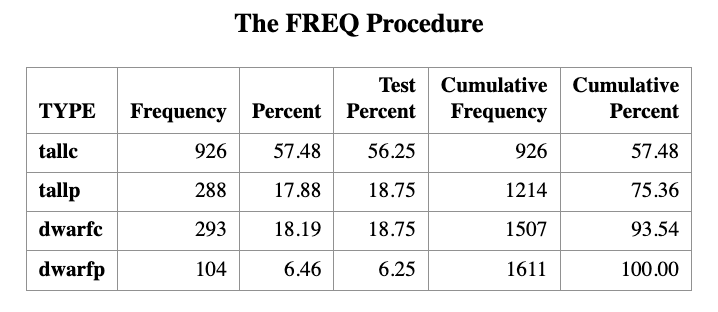

**Step 2: Pearson chi-square goodness-of-fit test**

``` r
PROC FREQ DATA=LEAF ORDER=DATA;
    WEIGHT COUNT;
    TABLES TYPE / ALL CHISQ
        TESTP=(56.25 18.75 18.75 6.25);
RUN;
```

The proportions (56.25, 18.75, 18.75, 6.25) correspond to the theoretical probabilities $(9,3,3,1)/16$.

Manual Computation of Residuals, $X^2$, and $G^2$

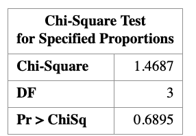

**Step 3: Define theoretical probabilities**

``` r
DATA PI;
    INPUT PI;
    PI = PI / 16;
CARDS;
9
3
3
1
;
RUN;
```

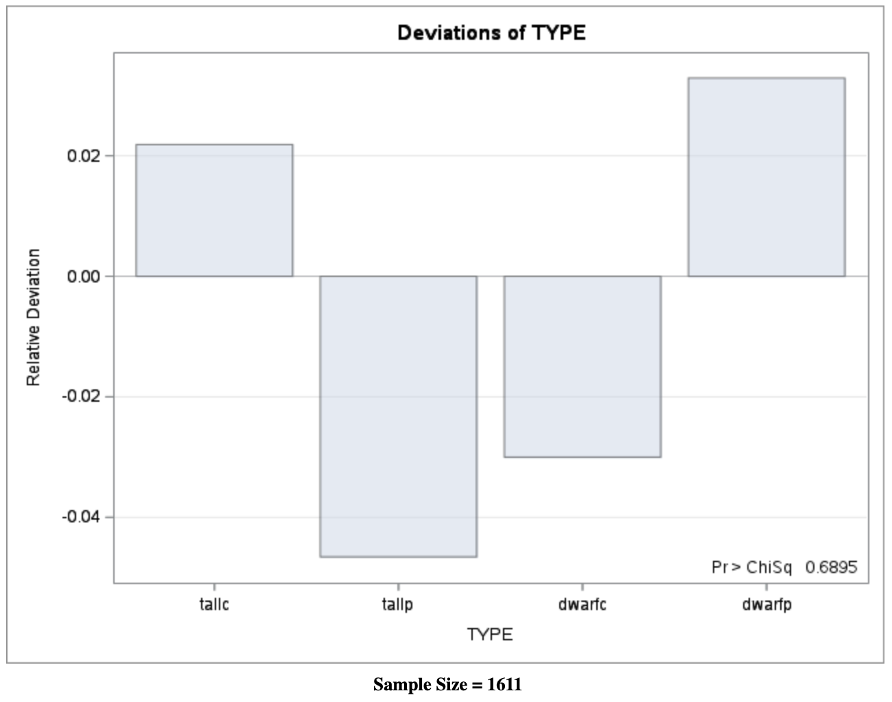

**Step 4: Compute expected counts and residuals**

``` r
DATA CAL;
    MERGE LEAF PI;
    ECOUNT = 1611 * PI;

    /* Pearson residual */
    RES = (COUNT - ECOUNT) / SQRT(ECOUNT);

    /* Deviance residual */
    DEVRES = SQRT(ABS(2 * COUNT * LOG(COUNT / ECOUNT)))
             * SIGN(COUNT - ECOUNT);
RUN;

PROC PRINT DATA=CAL;
RUN;
```

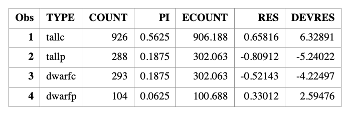

**Step 5: Compute** $X^2$ and $G^2$ explicitly

``` r
PROC SQL;
    SELECT
        SUM((COUNT - ECOUNT)**2 / ECOUNT) AS X2,
        1 - PROBCHI(CALCULATED X2, 3)     AS PVAL1,
        2 * SUM(COUNT * LOG(COUNT / ECOUNT)) AS G2,
        1 - PROBCHI(CALCULATED G2, 3)     AS PVAL2
    FROM CAL;
QUIT;
```

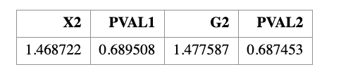

Visualization: Observed vs Expected Counts

``` r
GOPTIONS RESET=ALL;
SYMBOL1 V=CIRCLE C=BLUE I=NONE;
SYMBOL2 V=CIRCLE C=RED  I=NONE;

LEGEND1 LABEL=NONE
        VALUE=('Observed Count' 'Expected Count')
        ACROSS=1
        POSITION=(TOP RIGHT INSIDE)
        MODE=PROTECT;

TITLE "Tomato Phenotypes";

PROC GPLOT DATA=CAL;
    PLOT COUNT*TYPE ECOUNT*TYPE / OVERLAY LEGEND=LEGEND1;
RUN;
QUIT;

TITLE;
```

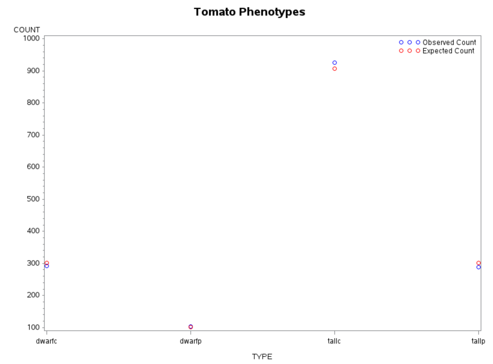

Interpretation

-   Small values of $X^2$ and $G^2$ indicate good agreement with the model
-   Large $p$-values confirm no strong evidence against the $9:3:3:1$ ratio
-   Both Pearson and deviance statistics lead to the same conclusion

This example illustrates how goodness-of-fit testing connects theory, computation, and visualization in categorical data analysis.

:::
