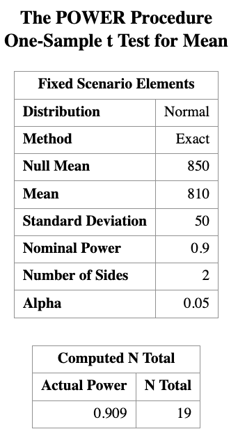
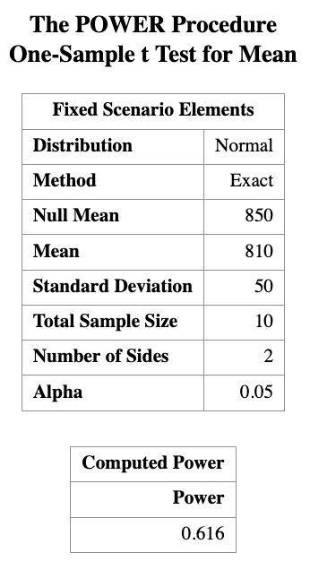
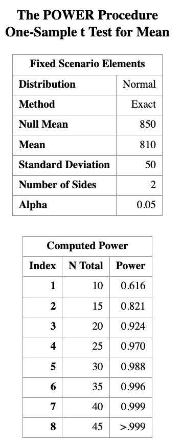
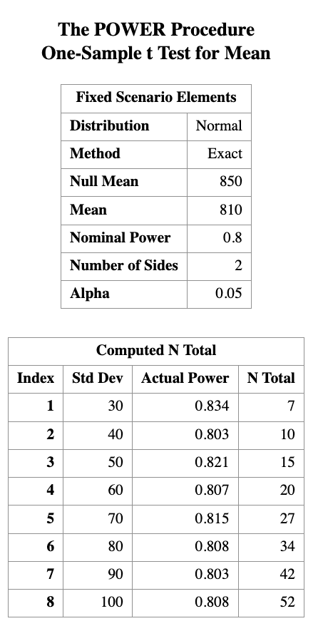

# Power Analysis with application in one sample $t$-test

> Learning Objectives
>
> 1. Understand what power analysis is.
> 2. Explain why and when we need power analysis.


## 1 Introduction

A **power analysis** is a calculation that helps you determine the **minimum sample size** required for a study to reliably detect an effect of interest.

A power analysis is built around **four main components**.  
If you know (or can reasonably estimate) **any three** of them, you can solve for the **fourth**.

### Key Components of Power Analysis

- **Statistical power**  
  The probability that a statistical test will correctly detect an effect of a certain size *when the effect truly exists*.  
  Power is commonly set at **80% (0.8)** or higher.

- **Sample size**  
  The minimum number of observations needed to detect an effect of a given size with a specified power level.

- **Significance level ($\alpha$)**  
  The maximum probability of rejecting a true null hypothesis (Type I error).  
  Typically set at **$\alpha = 0.05$**.

- **Expected effect size**  
  A standardized measure that quantifies the magnitude of the expected effect.  
  This is often based on:
  - prior studies,
  - pilot data, or
  - subject-matter considerations.


## Motivation Examples

::: {.callout-example title="Light Bulb Lifetime"}

A company that manufactures light bulbs claims that a particular type of light bulb lasts **850 hours on average**, with a **standard deviation of 50 hours**.

A consumer protection group believes that the manufacturer has **overestimated the average lifespan by about 40 hours**.

**Question:**  
How many light bulbs does the consumer protection group need to test in order to demonstrate this discrepancy with reasonable confidence?

This is a classic **sample size determination problem**, where:

- the effect size is the difference between the claimed mean and the suspected true mean,
- the variability is known or estimated,
- and power and significance level must be specified.

:::

::: {.callout-example title="Height of Graduate Students"}

It has been estimated that the average height of **American white male adults** is **70 inches**.

Suppose it is postulated that there is a **positive correlation between height and intelligence**.  
If this is true, then the average height of **white male graduate students** on campus should be **greater than 70 inches**.

You plan to test this hypothesis by randomly sampling a group of white male graduate students.

**Key question:**  
How small can the sample be (or how few individuals do you need to measure) and still have enough power to detect a meaningful difference?

This motivates power analysis for a **one-sided one-sample *t*-test**, where:

- the null hypothesis specifies a reference mean,
- the alternative hypothesis specifies a directional effect,
- and the goal is to balance feasibility (small sample size) with statistical reliability (adequate power).

:::

*In the remainder of this lecture, we will formalize these ideas and use the one-sample* $t$-*test to illustrate how power, sample size, effect size, and significance level are mathematically connected.*


## Before We Start the Analysis

For the power analysis in this lecture, we focus on the first example, which concerns testing the *average lifespan of a light bulb*. Our **first goal** is to determine the **number of light bulbs that must be tested**. That is, we want to find the **sample size** for a given significance level and power. Next, we will reverse the process and determine the **power**, given a sample size and significance level.

We know that the manufacturer claims the average lifespan of the light bulb is **850 hours**, with a **standard deviation of 50 hours**, while the consumer protection group believes that the manufacturer has overestimated the lifespan by about **40 hours**.

In terms of hypotheses:

- Null hypothesis:  $H_0: \mu = 850$
- Alternative hypothesis:  $H_A: \mu = 810$

The **significance level** is the probability of a **Type I error**, that is, rejecting $H_0$ when it is actually true. We will set $\alpha = 0.05.$

The **power of the test** against $H_A$ is the probability that the test **rejects $H_0$ when $H_A$ is true**. We will set the desired power level to  $\text{Power} = 0.90.$


Before proceeding with the power analysis, let us briefly discuss the role of the **standard deviation**. Intuitively, the number of light bulbs required for testing depends on the **variability** of their lifespans:

- If all light bulbs had exactly the same lifespan, then testing a single bulb would suffice.
- In reality, lifespans vary substantially. For example, some bulbs may last 1000 hours, while others may last 500 hours.

Therefore, the **standard deviation of the lifespan distribution** plays a critical role in determining the required sample size.

## Power Analysis in SAS

In SAS, it is straightforward to perform a power analysis for **comparing means** using `PROC POWER`.

To compute the required sample size:

1. Specify the mean under the null hypothesis.
2. Specify the mean under the alternative hypothesis.
3. Specify the population standard deviation.
4. Set the significance level $\alpha$ (default is 0.05).
5. Specify the desired power level. Here we set $\text{Power}=0.90$.
6. Indicate that the test is a **one-sample *t*-test**.

The following SAS code performs a power analysis for **Example 1**:

```r
PROC POWER;
    ONESAMPLEMEANS TEST=t
        NULLMEAN = 850
        MEAN     = 810
        STDDEV   = 50
        POWER    = 0.9
        NTOTAL   = .;
RUN;
```

This code tells SAS to solve for the total sample size (ntotal) needed to achieve 90% power for a one-sample $t$-test at significance level ($\alpha$ = 0.05).



The result tells us that we need a **sample size of at least 19 light bulbs** in order to reject $H_0$ under the alternative hypothesis $H_A$ with a **power of 0.9**.


Next, suppose we have a sample of size $n = 10$. How much power do we have if we keep all other quantities the same?  We can use the same SAS program to calculate the power.

```r
PROC POWER;
    ONESAMPLEMEANS TEST=t
        NULLMEAN = 850
        MEAN     = 810
        STDDEV   = 50
        POWER    = .
        NTOTAL   = 10;
RUN;
```



You can see that the power is about 0.616 for a sample size of 10. 


> This means that if we only test 10 light bulbs, we have about a 61.6% chance of correctly rejecting the null hypothesis when the true mean is 810 hours. This is below the commonly desired power level of 0.8, indicating that a sample size of 10 may not be sufficient to reliably detect the effect size of interest.


What if we have sample size of 15 or 20? We can use ta list of sample sizes as input to `PROC POWER`.


```r
PROC POWER;
    ONESAMPLEMEANS TEST=t
        NULLMEAN = 850
        MEAN     = 810
        STDDEV   = 50
        POWER    = .
        NTOTAL   = 10 to 45 by 5;
RUN;
```



We can also expect that if we actually know the standard deviation is smaller, we would need fewer light bulbs to achieve the same power. We can vary the standard deviation in `PROC POWER` to see how it affects the required sample size.

```r
PROC POWER;
    ONESAMPLEMEANS TEST=t
        NULLMEAN = 850
        MEAN     = 810
        STDDEV   = 30 to 100 by 10
        POWER    = 0.8
        NTOTAL   = . ;
RUN;
```



Here, varying `STDDEV` to show how reduced variability lowers required sample size, while keeping the hypothesis, effect size, and power fixed.

## Discussion 

**Normality assumption**

One technical assumption underlying the power analysis: the **normality assumption**. If the variable of interest is not normally distributed, a small sample size will usually *not* achieve the power indicated by the theoretical results, because those results are derived under normality. In such cases, it may not even be appropriate to conduct a one-sample *t*-test with a very small sample size when the normality assumption is questionable.

**Relative difference**

There is another important technical point. What truly matters for power analysis is **not the individual values**, but the **difference between the two means**, relative to the variability of the data. In fact, what really determines the power is the ratio

$$
\frac{\text{difference in means}}{\text{standard deviation}},
$$

which is referred to as the **effect size**.

For example, we would obtain the same power if we subtracted 800 from both means, changing 850 to 50 and 810 to 10. The absolute scale of the data does not affect the power, only the standardized difference does.

```r
PROC POWER;
    ONESAMPLEMEANS TEST=t
        NULLMEAN = 50
        MEAN     = 10
        STDDEV   = 50
        POWER    = 0.9
        NTOTAL   = . ;
RUN;
```

If we standardize our variable, we can calculate the means in terms of change in standard deviation.

```r
PROC POWER;
    ONESAMPLEMEANS TEST=t
        NULLMEAN = 1
        MEAN     = 0.2
        STDDEV   = 1
        POWER    = 0.9
        NTOTAL   = . ;
RUN;
```

::: {.callout-note title="Key Takeaway"}

It is usually not an easy task to determine the **“true” effect size**. In practice, we make our best guess based on existing literature or evidence from a pilot study. A good estimate of the effect size is **crucial** for a successful power analysis.

:::

## Math behind the power analysis

- We saw earlier that in tests of significance there are two types of errors.  
  Each error has a given probability of occurring.

  - The **significance level** (Type I error) is  
    $$
    \alpha = P(\text{reject } H_0 \mid H_0 \text{ is true}).
    $$

  - The probability of a **Type II error** is  
    $$
    \beta = P(\text{fail to reject } H_0 \mid H_0 \text{ is false}).
    $$

- The **power of a test** is related to the probability of a Type II error.  
  It is defined as
  $$
  \begin{aligned}
  1 - \beta&= 1 - P(\text{fail to reject } H_0 \mid H_0 \text{ is false})\\
  &= P(\text{reject } H_0 \mid H_0 \text{ is false}).
  \end{aligned}
  $$

- Therefore, to define power, we must be specific about what  
  **“when $H_0$ is false”** means.

## A Visualization Example

Bottles of a popular cola drink are supposed to contain 300 ml of cola.  
There is some variation from bottle to bottle because the filling machine is not perfectly precise.

Suppose the distribution of the contents is normal with standard deviation  
$$
\sigma = 3 \text{ ml}.
$$

We want to carry out the following hypothesis test at significance level $\alpha = 0.05$,  
based on a sample of six bottles of cola:
$$
H_0 : \mu = 300
\quad \text{versus} \quad
H_1 : \mu < 300.
$$

If the power is calculated under the alternative hypothesis with
$$
\mu = 297,
$$
then we can visualize $\alpha$ and $\beta$ as follows.


``` {r, echo = FALSE}
## ------------------------------------------------------------
## Recreate the power picture (H0 vs H1) using base R
## Left-tailed test: H0: mu = 300  vs  H1: mu < 300
## Visualize alpha (Type I), beta (Type II), and power (1 - beta)
## ------------------------------------------------------------

## Parameters (match the slide example)
mu0   <- 300      # null mean
mu1   <- 297      # alternative mean used to define power
sigma <- 3        # population SD (assumed known here for visualization)
n     <- 6        # sample size
alpha <- 0.05     # significance level (left-tailed)

## Sampling distribution of sample mean (normal approximation)
se <- sigma / sqrt(n)

## Critical cutoff c for a left-tailed test: reject H0 if Xbar <= c
c <- qnorm(alpha, mean = mu0, sd = se)

## Grid for plotting
x <- seq(mu1 - 5*se, mu0 + 5*se, length.out = 2000)

## Densities of Xbar under H0 and under the chosen alternative (mu1)
f0 <- dnorm(x, mean = mu0, sd = se)
f1 <- dnorm(x, mean = mu1, sd = se)

## Plot
plot(x, f1, type = "l", lwd = 2, col = "blue",
     xlab = "", ylab = "", ylim = c(0, max(f0, f1) * 1.05))
lines(x, f0, lwd = 2, col = "red")

## Vertical reference lines at the two means
abline(v = mu1, col = "gray60", lwd = 2)
abline(v = mu0, col = "gray60", lwd = 2)

## (Optional) show the critical cutoff line
abline(v = c, col = "gray60", lwd = 2, lty = 2)

## Shade alpha under H0: area left of cutoff under red curve
x_alpha <- x[x <= c]
y_alpha <- dnorm(x_alpha, mean = mu0, sd = se)
polygon(c(x_alpha, rev(x_alpha)),
        c(y_alpha, rep(0, length(y_alpha))),
        border = NA, col = adjustcolor("red", alpha.f = 0.25))

## Shade beta under H1: area right of cutoff under blue curve
x_beta <- x[x >= c]
y_beta <- dnorm(x_beta, mean = mu1, sd = se)
polygon(c(x_beta, rev(x_beta)),
        c(y_beta, rep(0, length(y_beta))),
        border = NA, density = 25, angle = 45, col = "blue")

## Labels (simple, optional)
mtext("Overall", side = 3, at = c, line = -2, cex = 0.9)

## Legend
legend("topright",
       legend = c(expression(paste("Under ", H[1], ": ", mu, " = 297")),
                  expression(paste("Under ", H[0], ": ", mu, " = 300")),
                  expression(paste(alpha, " (Type I) under ", H[0])),
                  expression(paste(beta, " (Type II) under ", H[1]))),
       lwd = c(2, 2, NA, NA),
       col = c("blue", "red", NA, NA),
       bty = "n")
```

### Interpretation of the Power Visualization

The figure above illustrates the concepts of **Type I error ($\alpha$)**,  
**Type II error ($\beta$)**, and **power ($1-\beta$)** for a **left-tailed one-sample $t$-test**.

- The **red curve** represents the sampling distribution of the test statistic
  under the **null hypothesis**  
  $$
  H_0 : \mu = 300.
  $$

- The **blue curve** represents the sampling distribution under the
  **alternative hypothesis**  
  $$
  H_1 : \mu = 297.
  $$

- The **vertical cutoff line** corresponds to the critical value determined
  by the significance level $\alpha = 0.05$.

**Type I Error ($\alpha$)**

- The **red shaded region** to the left of the cutoff is
  $$
  \alpha = P(\text{reject } H_0 \mid H_0 \text{ is true}).
  $$
- This is the probability of incorrectly rejecting the null hypothesis.

**Type II Error ($\beta$)**

- The **blue shaded region** to the right of the cutoff is
  $$
  \beta = P(\text{fail to reject } H_0 \mid H_0 \text{ is false}).
  $$
- This is the probability of failing to detect the true mean $\mu = 297$.

**Power ($1 - \beta$)**

- Power increases when:
  - the true mean moves farther away from $300$,
  - the sample size increases,
  - or the variability ($\sigma$) decreases.

This visualization highlights that **power is not a single number**, but depends
on *which alternative value* of $\mu$ we consider when $H_0$ is false.

