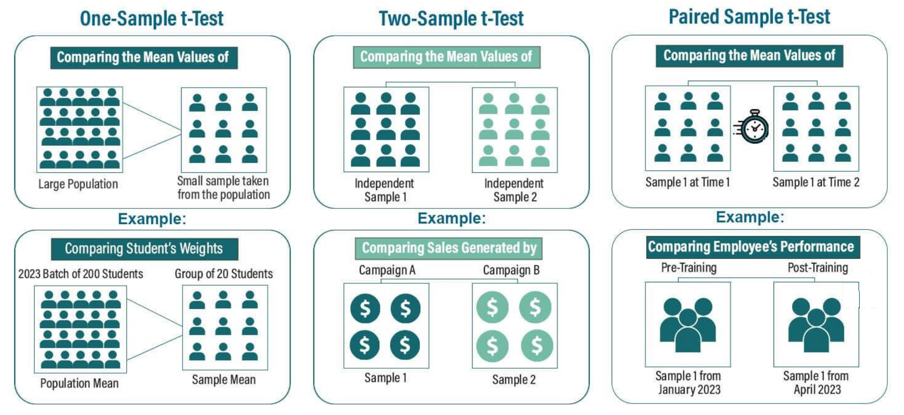
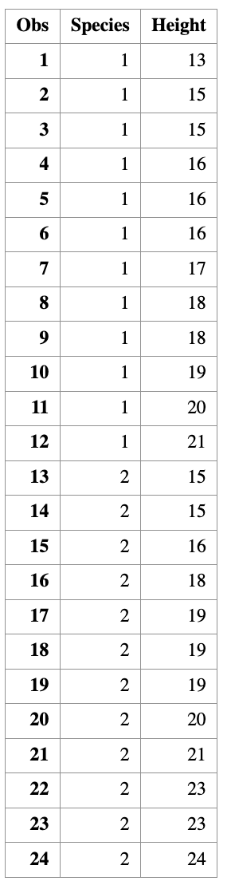
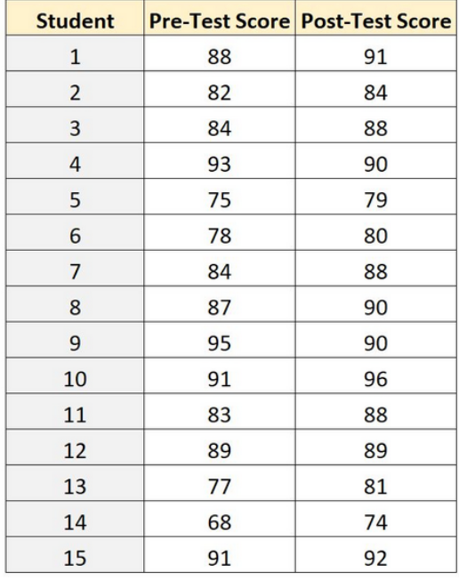
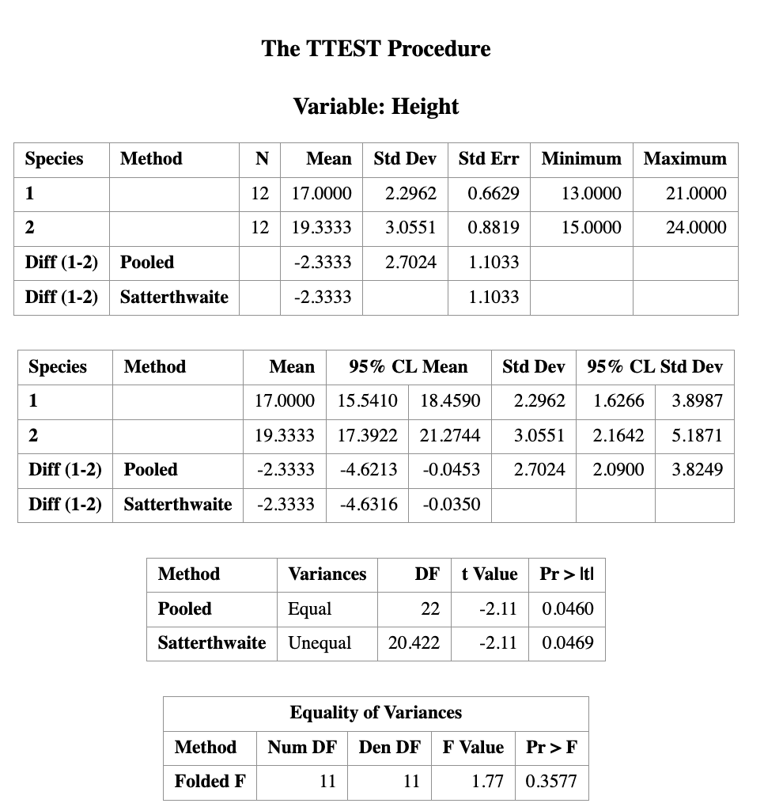
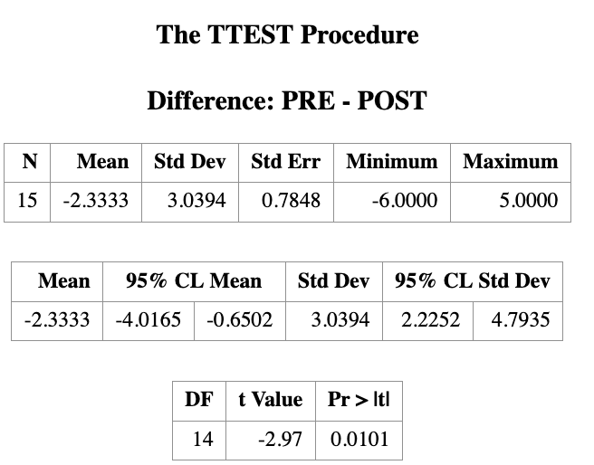

# Two Sample $t$-test for Independent and Paired Data

> Learning Objectives
>
> 1. Distinguish between **independent** and **paired** two-sample t-tests.
> 2. Identify the **appropriate test** based on study design.
> 3. State the **model assumptions** for each test.
> 4. Perform two-sample t-tests in **SAS** using `PROC TTEST`.
> 5. Interpret **test statistics, p-values, and confidence intervals**.


In many applications, we want to compare **two populations**, for example:

- Treatment vs control groups
- Male vs female outcomes
- Before vs after an intervention
- Method A vs Method B

The key question is:

> **Are the population means different?**

This leads to **two-sample inference**.



Since we see that there are different scenarios for the $t$-test, we may have another question:

> **Which $t$-test should I use?**

The answer depends on the **study design**. We will discuss two main types of two-sample $t$-tests:

1. **Independent two-sample $t$-test**: Used when the two samples are independent of each other (e.g., treatment vs control groups).

```r
/*==========================================================
  Create the dataset for two-sample t-test example
  Variables:
    Species : group indicator (1 or 2)
    Height  : numeric response
==========================================================*/

DATA my_data;
    INPUT Species Height;
    DATALINES;
  1 13
  1 15
  1 15
  1 16
  1 16
  1 16
  1 17
  1 18
  1 18
  1 19
  1 20
  1 21
  2 15
  2 15
  2 16
  2 18
  2 19
  2 19
  2 19
  2 20
  2 21
  2 23
  2 23
  2 24
;
RUN;

/* Optional: check the data */
PROC PRINT DATA=my_data;
RUN;
```

{width=30%} 

2. **Paired two-sample $t$-test**: Used when the two
samples are related or paired (e.g., before vs after measurements on the same subjects).

{width=50%} 

## Inference Goals of the Two Sample *t*-Test

Suppose the two population means are denoted by:

$$\mu_1 \quad \text{and} \quad \mu_2.$$

A two-sample $t$-test always begins with the same **null hypothesis**:

$$ H_0: \mu_1 = \mu_2 .$$

That is, the two population means are equal. The alternatively hypothesis can take different forms.

**Alternative Hypotheses**

Depending on the scientific question, the alternative hypothesis can take one of three forms. 

1. Two-sided (two-tailed): $H_1: \mu_1 \neq \mu_2$

> The two population means are different.

2. Left-tailed: $H_1: \mu_1 < \mu_2$

> Population 1 has a *smaller* mean than population 2.

3. Right-tailed: $H_1: \mu_1 > \mu_2$

> Population 1 has a *larger* mean than population 2.

**Confidence Interval Interpretation**

When constructing a confidence interval, inference is made on the **difference of means**: $\mu_1 - \mu_2$. 

+ If the confidence interval **contains 0**, we fail to reject $H_0$.
+ If the confidence interval **does not contain 0**, we reject $H_0$.

## Sample SAS code


### Two Independent Sample $t$-test

``` r
/*======================================================
  Example: Two-Sample t-Test (Independent Samples)
  STAT 8678 — Two-Sample t-Test
======================================================*/

/*------------------------------
  Create the dataset
------------------------------*/
DATA my_data;
    INPUT Species $ Height;
    DATALINES;
1 13
1 15
1 15
1 16
1 16
1 16
1 17
1 18
1 18
1 19
1 20
1 21
2 15
2 15
2 16
2 18
2 19
2 19
2 19
2 20
2 21
2 23
2 23
2 24
;
RUN;

/*------------------------------
  Two-sample t-test
  H0: μ1 − μ2 = 0
  Two-sided test, α = 0.05
------------------------------*/
PROC TTEST DATA=my_data
           SIDES=2
           ALPHA=0.05
           H0=0;
    CLASS Species;
    VAR Height;
RUN;
```




> **Note on Two-Sample t-Test Methods in SAS**

In `PROC TTEST`, SAS reports results from **two different methods** by default:

- **Method: Pooled**  
  This corresponds to the **two-sample equal-variance t-test**, which assumes  
  \[
  \sigma_1^2 = \sigma_2^2.
  \]
  The test statistic uses a **pooled variance estimator**.

- **Method: Satterthwaite**  
  This corresponds to the **two-sample unequal-variance t-test**, also known as the  
  **Welch t-test**.  
  No assumption of equal variances is required, and the degrees of freedom are
  approximated using the **Satterthwaite formula**.

> **Practical guidance:**  
> When the equal-variance assumption is questionable, the **Satterthwaite (Welch) test**
> is generally preferred and is the default recommendation in modern practice.

### Paired Sample $t$-test

``` r
/* Create dataset */
DATA test_scores;
    INPUT PRE POST;
    DATALINES;
88 91
82 84
84 88
93 90
75 79
78 80
84 88
87 90
95 90
91 96
83 88
89 89
77 81
68 74
91 92
;
RUN;


/*view dataset*/
PROC PRINT DATA=test_scores;

/*perform paired samples t-test*/
PROC TTEST DATA=test_scores ALPHA=.05;
PAIRED PRE*POST;
RUN;
```




## Statistical Assumptions of the Two Sample $t$-Test

The validity of a two-sample $t$-test relies on the following assumptions:

1. **Continuous data**  
   The response variable is continuous (not discrete or categorical).

2. **Normality**  
   The data in each population follow a normal distribution.  
   - In practice, the two-sample t-test is reasonably robust to mild departures from normality, especially for moderate or large sample sizes.

3. **Equal variances (for the pooled t-test)**  
   The population variances of the two groups are equal:
   $$
   \sigma_1^2 = \sigma_2^2.
   $$
   - If this assumption is violated, the **Welch (Aspin–Welch / Satterthwaite) two-sample t-test** should be used instead.

4. **Independence of samples**  
   The two samples are independent of each other.  
   - There is no relationship between individuals in Sample 1 and Sample 2.
   - If observations are paired or matched, a **paired t-test** should be used instead.

5. **Random sampling**  
   Both samples are simple random samples from their respective populations.  
   Each individual in the population has an equal probability of being selected.

## Other Two-Sample Tests

As discussed in the one-population setting, there are several hypothesis tests related to the two-sample problem beyond the two-sample *t*-test. The most common ones include:


### Two-Proportion *Z* Test

This test is used to compare **two population proportions**.

**Hypothesis Testing**

Let $p_1$ and $p_2$  denote the two population proportions.

- **Null hypothesis**
  $$
  H_0: p_1 = p_2
  $$
  (the two population proportions are equal)

- **Alternative hypotheses**

  - Two-tailed:
    $$
    H_1: p_1 \neq p_2
    $$
    (the two population proportions are not equal)

  - Left-tailed:
    $$
    H_1: p_1 < p_2
    $$
    (population 1 proportion is less than population 2 proportion)

  - Right-tailed:
    $$
    H_1: p_1 > p_2
    $$
    (population 1 proportion is greater than population 2 proportion)

+ **Confidence Interval**
Inference is made on the difference in proportions:
$$
p_1 - p_2.
$$

### Two-Sample Variance *F* Test

This test is used to compare **two population variances**.

**Hypothesis Testing**

Let $\sigma_1^2$ and $\sigma_2^2$ denote the two population variances.

- **Null hypothesis**
  $$
  H_0: \sigma_1^2 = \sigma_2^2
  $$
  (the two population variances are equal)

- **Alternative hypotheses**

  - Two-tailed:
    $$
    H_1: \sigma_1^2 \neq \sigma_2^2
    $$
    (the two population variances are not equal)

  - Left-tailed:
    $$
    H_1: \sigma_1^2 < \sigma_2^2
    $$
    (population 1 variance is less than population 2 variance)

  - Right-tailed:
    $$
    H_1: \sigma_1^2 > \sigma_2^2
    $$
    (population 1 variance is greater than population 2 variance)

+ **Confidence Interval** Inference is made on the ratio of variances:
$$
\frac{\sigma_1^2}{\sigma_2^2}.
$$


### Summary

| Test | Parameter of Interest | CI Targets |
|-----|----------------------|-----------|
| Two-sample *t*-test | $\mu_1 - \mu_2$ | Difference in means |
| Two-proportion *Z* test | $p_1 - p_2$ | Difference in proportions |
| Two-sample *F* test | $\sigma_1^2 / \sigma_2^2$ | Ratio of variances |

