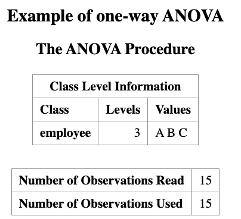
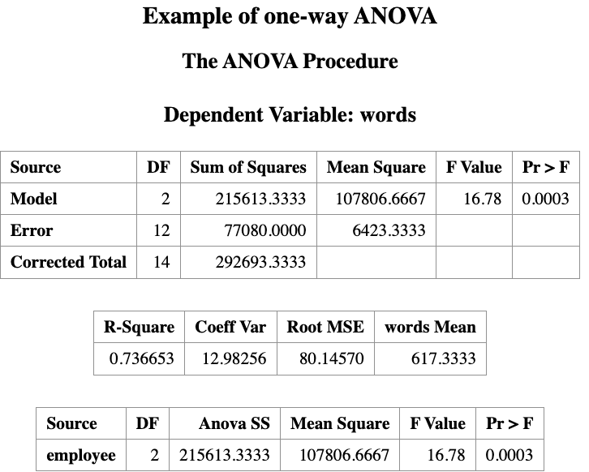
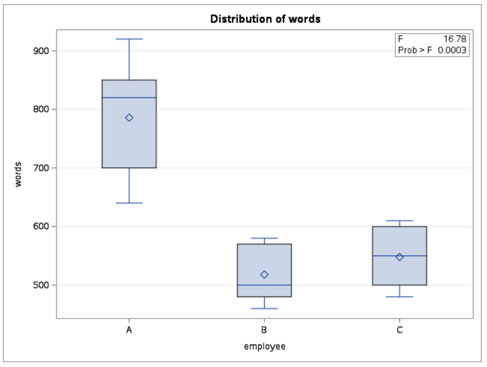
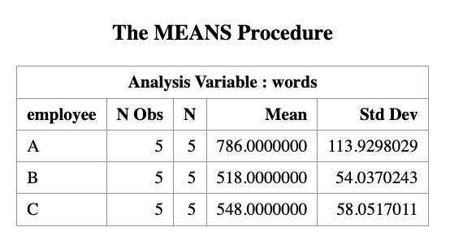
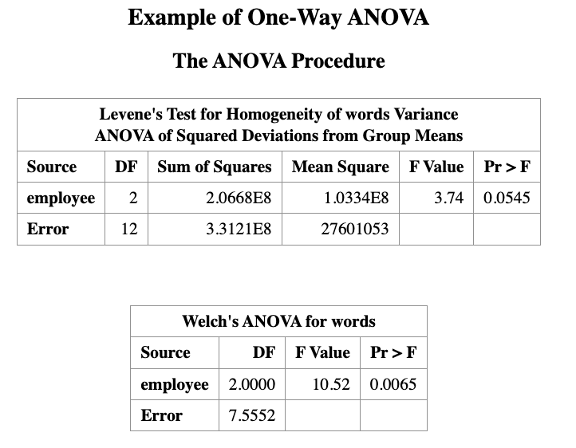
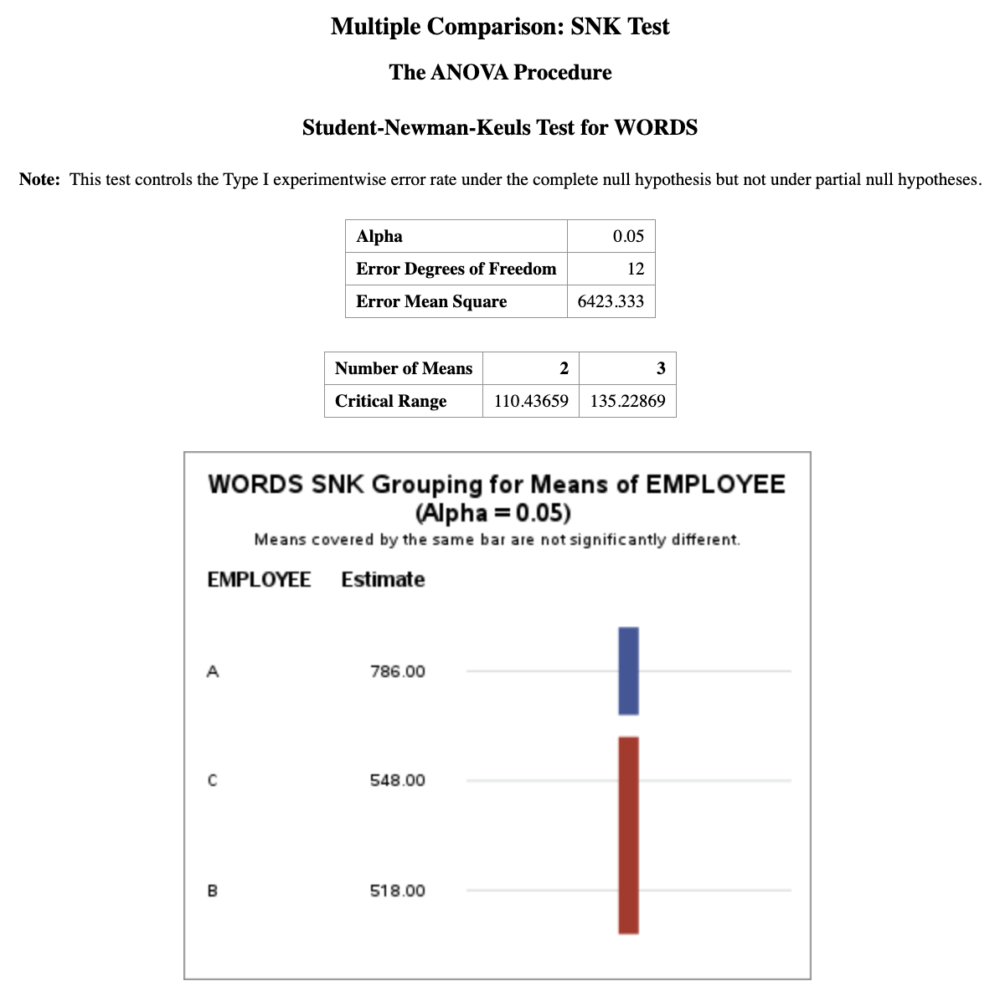

# Analysis of Variance

> Learning Objectives
>
> 1.  Understand what **ANOVA (Analysis of Variance)** is.
> 2.  Explain **why and when** ANOVA is needed.
> 3.  Recognize the connection between **two-sample t-tests** and **one-way ANOVA**.
> 4.  Formulate ANOVA models and hypotheses.
> 5.  Perform one-way ANOVA in **SAS** and interpret the output.

## Introduction

In the previous lecture, we studied the **two-sample t-test**, where the goal was to compare the means of **two independent populations**.

Recall the equal-variance two-sample model: 
$$
\begin{aligned}
X_{1i} &\stackrel{iid}{\sim} N(\mu_1, \sigma^2), \quad i = 1, \ldots, n_1, \\
X_{2j} &\stackrel{iid}{\sim} N(\mu_2, \sigma^2), \quad j = 1, \ldots, n_2,
\end{aligned}
$$ {#eq-model1}
with inference focused on the mean difference $$
\mu_1 - \mu_2.
$$

The corresponding hypothesis test was: $$
H_0: \mu_1 = \mu_2.
$$

### From Two-Sample t-Test to ANOVA

A natural question arises:

> **What if we want to compare more than two population means?**

For example: 

- Comparing test scores across **three or more teaching methods** 
- Comparing average yields across **multiple fertilizer types** 
- Comparing mean response times across **several algorithms**

Running multiple pairwise t-tests is **not appropriate**, because: 

- It inflates the **Type I error rate** 
- It leads to inconsistent inference

This motivates the need for **ANOVA**.

## ANOVA as a Generalization of the Two-Sample t-Test

To unify the two-sample setting, we can rewrite the data using an **indicator variable**.

Let the combined data be: $$
\{(I_{i,2}, Y_i)\}_{i=1}^{n_1+n_2},
$$ where $$
I_{i,2} =
\begin{cases}
1, & \text{if observation } i \text{ comes from group 2}, \\
0, & \text{otherwise}.
\end{cases}
$$

Then the two-sample model can be written as a **linear model**: $$
Y_i = \alpha + \beta_1 I_{i,2} + \varepsilon_i,\quad \varepsilon_i \stackrel{iid}{\sim} N(0, \sigma^2).
$$  {#eq-model2}

Here, note that models @eq-model1 and the linear model @eq-model2 are **equivalent**. Specifically:

-   $\alpha=\mu_1$, represents the mean of group 1. This is referred as the *baseline effect*
-   $\beta_1 = \mu_2 - \mu_1$, this is the group effect, representing the difference between group 2 and group 1.
-   Testing $\mu_1 = \mu_2$ is equivalent to testing: $$
    H_0: \beta_1 = 0
    $$


Note, we can also write the model in terms of group 2, and use it as the baseline group. In this case, $\beta_1$ is the difference effect form group 1, and the null hypothesis would be $H_0: \beta_1 = 0$ as well.

## ANOVA Analysis: Compare Multiple Mean Values

Now, we see how to extend @eq-model2 to compare the population mean from multiple groups. Suppose now we have $K > 2$ groups.


The previous model @eq-model2 can be extended to compare the population mean across **multiple groups (more than two)**.  
Suppose we have **three groups** (1, 2, 3) and choose **group 1 as the baseline**.  
An extension of the model is

$$
X_i = \alpha + \beta_1 I_{i,2} + \beta_2 I_{i,3} + \epsilon_i
$$

where

- $I_{i,2}$ indicates whether the observation belongs to **group 2**
- $I_{i,3}$ indicates whether the observation belongs to **group 3**

The parameters have the interpretation

$$
\alpha = \mu_1
$$

$$
\beta_1 = \mu_2 - \mu_1
$$

$$
\beta_2 = \mu_3 - \mu_1
$$

Thus, statistical inference on $\beta_1$ and $\beta_2$ allows us to determine whether the **group means differ**.  
This type of analysis is known as **Analysis of Variance (ANOVA)**.

### When Do We Use ANOVA?

In general, ANOVA is used under similar assumptions as the **two-sample t-test**.

- If the independent variable has **two levels**, both  
  - a **two-sample t-test**, and  
  - **ANOVA**  
  can be used.

- If the independent variable has **three or more levels**,  
  **ANOVA is required**.

::: {.callout-example}

Suppose three reading instruction methods (A, B, C) are given to *15 subjects*.   

After instruction, a reading test is administered, and the number of words per minute is recorded.

The goal is to test whether the *instruction methods lead to different reading scores*.

:::

### Hypothesis Test

**Global test**

The ANOVA test examines whether **any group means differ**.

Our null hypothesis is:
$$
H_0: \mu_1 = \mu_2 = \mu_3.
$$

This means, there is no differences among group means.

The alternative Hypothesis is:
$$
H_1: \text{At least one pair of means is different}
$$

$$
(\mu_1 \ne \mu_2 \;\text{or}\; \mu_1 \ne \mu_3 \;\text{or}\; \mu_2 \ne \mu_3)
$$


**After the Global Test**

If the ANOVA test shows the null hypothesis is rejected, it tells us that **a difference exists**, but it does **not tell us where the difference occurs**.

Therefore, additional tests are performed to determine **which groups differ**.  
These are called **multiple comparison procedures**.

Examples include:

- Tukey's HSD
- Bonferroni correction
- Scheffé test

## ANOVA in SAS

``` r
DATA words;
INPUT words employee $;
DATALINES;
700  A
850  A
820  A
640  A
920  A
480  B
460  B
500  B
570  B
580  B
500  C
550  C
480  C
600  C
610  C
;
RUN;

PROC ANOVA DATA=words;
    TITLE Example of one-way ANOVA;
    CLASS employee;
    MODEL words = employee;
    MEANS employee / HOVTEST=WELCH;
RUN;

PROC MEANS DATA=words N MEAN STD;
    CLASS employee;
    VAR words;
RUN;
```

In the code chunk above:

+ The `MEANS` statement generates the **group mean values** of the dependent variable (`words`).  

+ The option `HOVTEST` is used to **check the homogeneity of variance assumption** across groups.  

+ The option `WELCH` performs **Welch’s ANOVA**, which is more appropriate when the **equal variance assumption is violated**.

+ More details about **assumption checking** will be discussed below.








### Interpretation of the outputs

Based on the data, we conduct a hypothesis test (with a **0.05 significance level**) to determine whether the **three instruction methods have different effects on the reading result**.

The ANOVA output contains a table labeled **Source**, which shows the **sources of variation** in the data.  
The term **Model** represents the effect of the independent variable (in this example, the **instruction method**).

One-way ANOVA is based on the **F-distribution**.  
The computed **F-statistic is 16.78**, with a **p-value of 0.0003**.

Since the **p-value < 0.05**, we **reject the null hypothesis**.

Therefore, we conclude that the **reading instruction methods do not all produce the same mean word counts**. In other words, **at least one instruction method differs from the others**.


Alternatively you can turn the `ODS GRAPHICS` on to get the diagnostic plots for ANOVA assumptions.

``` r
ODS GRAPHICS ON;
PROC ANOVA DATA=words;
    CLASS employee;
    MODEL words = employee;
    MEANS employee;
RUN;
ODS GRAPHICS OFF;
```

### Assumption Validation for the ANOVA Test

The ANOVA test assumes that:

- The **dependent variable** (`word`) is **continuous**, and the **independent variable** (`method`) is **categorical**.

- The experiment follows a **random and independent design**.  
  For example, the same person should **not be tested under all three instruction methods**, since that would create a **dependent (repeated-measures) design**.

- The samples (word counts from the three instruction methods) are **normally distributed** and have **equal variances**.

The **normality assumption** can be checked using the `PROC UNIVARIATE` procedure.

It is important to note that **ANOVA is relatively robust to mild departures from normality**, especially when sample sizes are similar.

The assumption of **equal variances (homogeneity of variances)** can be checked using the `HOVTEST` option in the `MEANS` statement:

```r 
MEANS method / HOVTEST=WELCH;
```
The result is what we have seen before, 




As shown in the output, the p-value from **Levene’s test** is **0.0545**, which is close to the significance level of **0.05**. Therefore, the result lies near the borderline.

Two interpretations are possible:

- If we use a significance level of **0.05**, there is **insufficient evidence to reject the null hypothesis of homogeneity of variances**.

- If a larger significance level is used (for example **0.10**), we would **reject the homogeneity assumption**. In that case, the **Welch ANOVA test** should be used instead.

Recall that:

- The p-value from the **regular ANOVA** (assuming equal variances, i.e., homogeneity) is **0.0003**.
- The p-value from **Welch’s ANOVA** (not assuming equal variances, heterogeneity) is **0.0065**.

At the **0.05 significance level**, both tests lead to the **same conclusion**:  
the **instruction methods have different effects on the reading results**.

## Multiple Comparison

In general, methods used to identify **which group means differ after a significant global ANOVA test** are called **multiple comparison tests** or **post hoc tests**.

SAS provides several procedures to investigate differences between levels of the independent variable. Examples include:

- Duncan’s multiple-range test (`DUNCAN`)
- Student–Newman–Keuls multiple-range test (`SNK`)
- Least significant difference test (`LSD`)
- Tukey’s studentized range test (`TUKEY`)
- Scheffé’s multiple-comparison procedure (`SCHEFFE`)

To request a multiple comparison test in SAS, place the desired test option **after a slash (`/`) in the `MEANS` statement**.

It is convenient to include the multiple comparison request **at the same time as the global ANOVA test**. However, the results of multiple comparisons should only be interpreted **after the global ANOVA test indicates a significant difference** among group means.

::: {.callout-example title="Student–Newman–Keuls (SNK) Test"}

The following SAS code performs the SNK multiple comparison test at a significance level of 0.05:


``` r
PROC ANOVA DATA=words;
    TITLE "Multiple Comparison: SNK Test";
    CLASS EMPLOYEE;
    MODEL WORDS = EMPLOYEE;
    MEANS EMPLOYEE / SNK ALPHA=0.05;
RUN;
```



Under the **SNK grouping** column, groups that share the **same letter** are **not significantly different**.

For example, groups **C** and **B** both have the letter **“B”** in the grouping column, indicating that their means are **not significantly different**.

Group **A** has the letter **“A”**, meaning that its mean is **significantly different** (p-value < 0.05) from the means of groups **B** and **C**.

Conclusion:\
method A performs significantly better than methods B and C, while methods B and C are not significantly different from each other.

:::

------------------------------------------------------------------------

::: {.callout-note title="Key Takeaways"}

+ The **two-sample t-test is a special case of ANOVA** when there are only two groups.

+ **ANOVA tests whether at least one group mean differs** among multiple groups using the **F-statistic**.

+ Before interpreting ANOVA results, we should **check assumptions**, especially **homogeneity of variances** (e.g., using **Levene’s test**).

+ If the equal variance assumption is violated, **Welch’s ANOVA** provides a more robust alternative.

+ If the **global ANOVA test is significant**, **post-hoc multiple comparison tests** (e.g., SNK, Tukey, LSD) are used to determine **which groups differ**.

:::