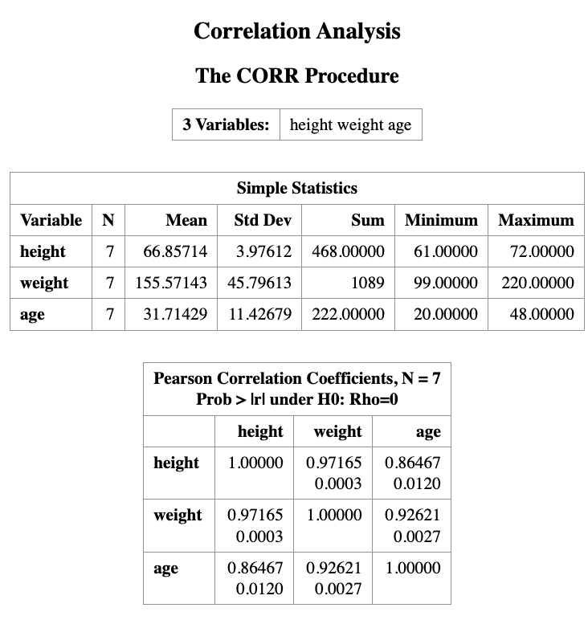
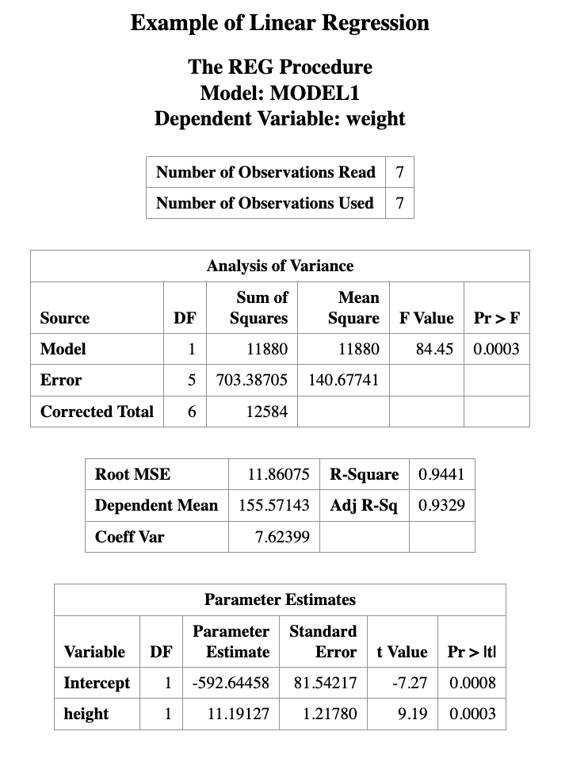
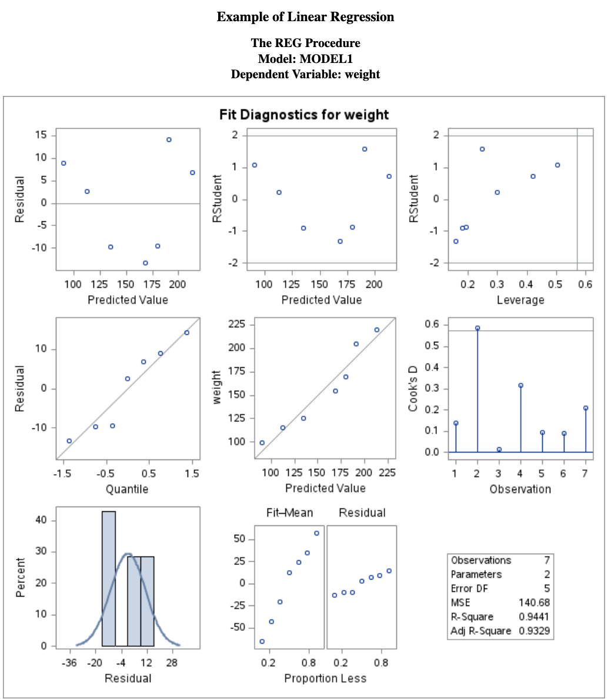
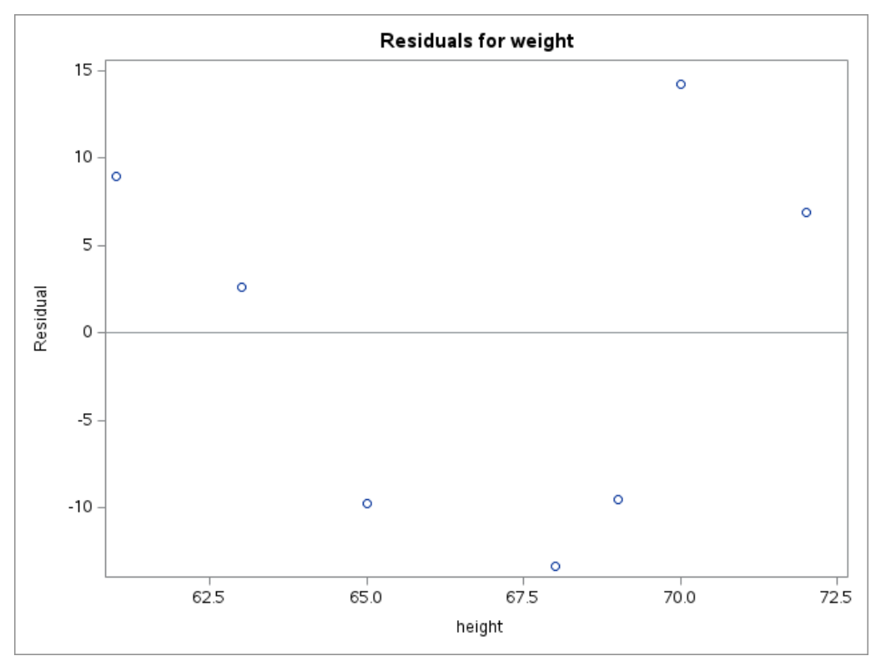
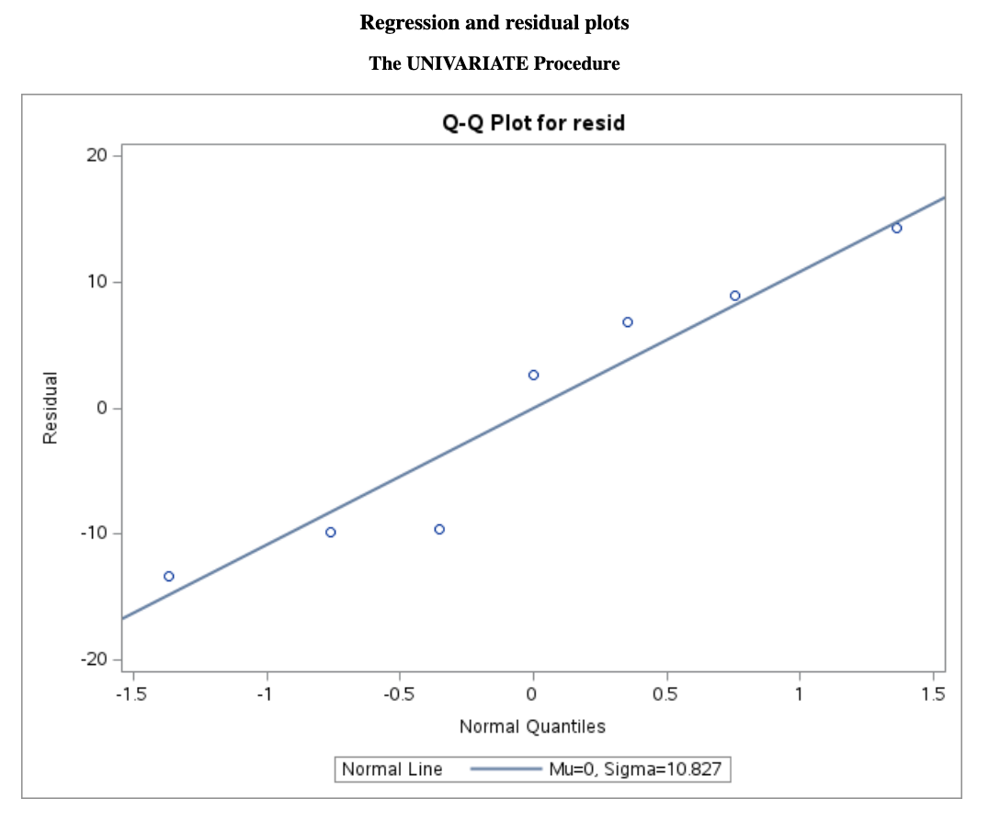
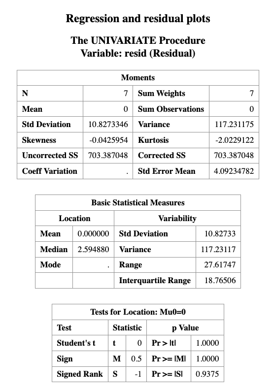
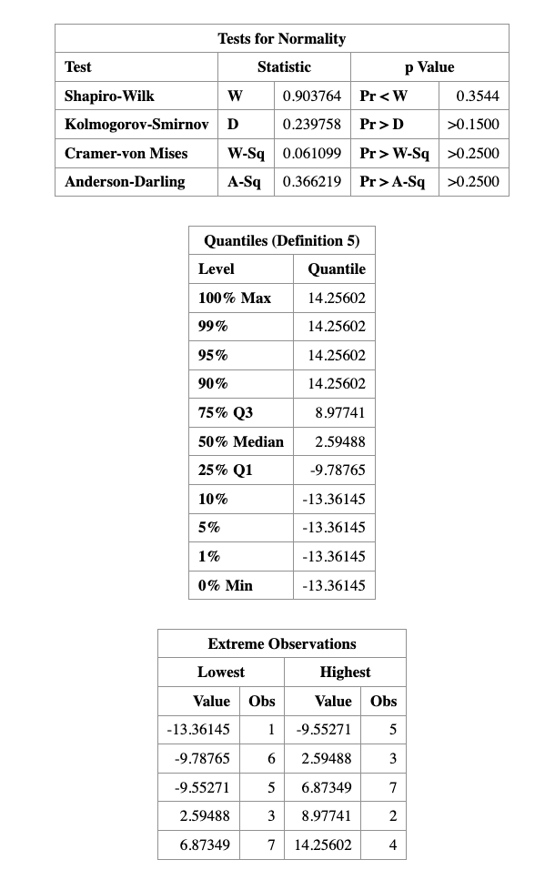

# Regression Analysis

> Learning Objectives
>
> 1. Understand what **regression analysis** is.
> 2. Explain the difference between **correlation** and **regression**.
> 3. Fit a **simple linear regression model**.
> 4. Interpret regression coefficients and statistical tests.
> 5. Perform regression analysis in **SAS** and interpret the output.
> 6. Check the **assumptions of linear regression** using diagnostic plots.


## Introduction

In many studies, the goal is not only to determine whether variables are related, but also to *quantify how one variable influences another*.

For example:

- How does height affect weight?
- How does study time affect exam score?
- How does advertising expenditure affect sales?

These types of questions are addressed using *regression analysis*.

Regression analysis studies the relationship between a **dependent variable** and one or more **independent variables**, and can also be used for **prediction**.


## Correlation vs Regression

Before fitting a regression model, it is often useful to examine the **correlation between variables**.

**Correlation**

- Measures the *strength and direction of linear association* between two variables.
- The correlation coefficient ranges from *-1 to 1*.
- Correlation is **symmetric**, meaning it does not distinguish between predictor and response variables.

However:

> **Correlation does not imply causation.**

A strong correlation between two variables does not necessarily mean that one variable **causes** the other.

Regression analysis goes further by specifying a **directional relationship** between variables.

## Correlation between Two Variables 

Suppose in a health screening, measurements are taken on several individuals:

- Gender
- Height
- Weight
- Age

An example dataset of such is given below.

```r
DATA measurement;
  INPUT gender $ height weight age;
  DATALINES;
  M 68 155 23
  F 61 99 20
  F 63 115 21
  M 70 205 45
  M 69 170 35
  F 65 125 30
  M 72 220 48
;
RUN;
```

To examine the correlation between every paired variables, we can use the `PROC CORR` procedure in SAS.

``` r
PROC CORR DATA=measurement;
  TITLE "Correlation Analysis";
  VAR height weight age;
RUN;
```



The output will show the correlation coefficients between each pair of variables, along with the corresponding p-values to test for statistical significance.


The output from PROC CORR provides:

+ Descriptive statistics for each variable
+ A Pearson correlation matrix
	
**Interpretation of the output**

The top number in each cell is the Pearson correlation coefficient, which measures the strength of the linear association between two variables.

The number below it is the p-value for testing

$$
H_0 : \rho = 0
$$

against

$$
H_1 : \rho \ne 0
$$

For example:

+ The correlation between height and weight is 0.9716.
+ The corresponding p-value is 0.003.

Since the p-value is less than 0.05, we conclude that height and weight are significantly correlated.

The correlation matrix is symmetric along the diagonal line, and each variable has a correlation of 1 with itself.

Important Note

Even when two variables show a strong correlation, this does not necessarily imply a causal relationship.

A strong association may occur because:

+ another hidden (confounding) variable influences both variables, or
+ the relationship is coincidental.

## Regression in SAS

Suppose our research question is:

> to investigate the *impact of one variable on another*, or to *predict the value of one variable based on another*.

If this is the case, the regression model can be used to achieve these goals.

In the example dataset, we are interested in studying the relationship between **height** and **weight**. For example:

- Does **height influence weight**?
- Can we **predict a person's weight given their height**?

To answer this question, we use a **simple linear regression model**.

The regression model can be written as

$$
\text{Weight} \sim \text{Height}
$$

which means we model **weight as a function of height**.

### Regression Model

The mathematical form of the simple linear regression model is

$$
Y = \beta_0 + \beta_1 X + \epsilon
$$

where

- $Y$ is the **dependent variable** (weight)
- $X$ is the **independent variable** (height)
- $\beta_0$ is the **intercept**
- $\beta_1$ is the **slope**
- $\epsilon$ is the **random error term**

with

$$
\epsilon \sim N(0,\sigma^2).
$$

The slope $\beta_1$ represents the **change in the expected value of $Y$ for a one-unit increase in $X$**.

**SAS Implementation**

In SAS, we fit the regression model using the `PROC REG` procedure.

```r
PROC REG DATA=measurement;
  TITLE "Example of Linear Regression";
  MODEL weight = height;
RUN;
```

In this code:

+ `PROC REG` fits a linear regression model.
+ `MODEL weight = height` specifies that weight is the response variable and height is the predictor variable.




## Interpreting the Regression Output

Linear regression assumes that the **dependent variable** (e.g., $Y$) depends linearly on the **independent variable** ($X$).  
The simple linear regression model is

$$
Y = \beta_0 + \beta_1 X + \epsilon
$$

where

- $\beta_0$ is the **intercept**
- $\beta_1$ is the **slope**
- $\epsilon$ is the **random error term**

with

$$
\epsilon \sim N(0, \sigma^2)
$$

The regression output provides estimates for $\beta_0$ and $\beta_1$.  
In this example, the fitted regression equation is

$$
\text{weight} = -592.64458 + 11.19127 \times \text{height}
$$

This equation can be used to **predict weight from height**.

### Example Prediction

For a person who is **70 inches tall**, the predicted weight is

$$
\hat{weight}
=
-592.64458 + 11.19127 \times 70
=
190.66
$$

Thus, the predicted weight for a **70-inch-tall person** is approximately **190.66 pounds**.

### Testing the Slope

In the regression output, the **Parameter Estimates** table includes the following columns:

- **Standard Error**
- **t Value**
- **Pr > |t|** (p-value)

These values are used to test the hypothesis

$$
H_0 : \beta_1 = 0
$$

which means that the predictor variable has **no linear effect** on the response variable.

If the p-value is **small (e.g., less than 0.05)**, we reject the null hypothesis.

In this example, the p-value for the slope is **0.0003**, which is much smaller than 0.05.

Therefore, we conclude that **height has a statistically significant linear effect on weight**.


## Assumption Validation for Linear Regression

Linear regression assumes that the **relationship between two variables is linear**, and that the **residuals** are **normally distributed**.

Residuals are defined as

$$
\text{Residual} = Y - \hat{Y}
$$

where $Y$ is the observed value and $\hat{Y}$ is the predicted value from the regression model.

These assumptions can be checked using **scatter plots** and **residual plots**.

The SAS regression procedure also produces several diagnostic figures that help evaluate the model assumptions.

The main diagnostic plots are shown below.

### Residual Diagnostics

From the **residual plot**, we should check the following:

- **Does the residual plot show an evenly scattered pattern around 0?**  

  A random “white-noise-like” scatter around zero suggests that the **linear model fits the data well**.

- **Do the residuals follow a normal distribution?**

  This can be examined using **normality diagnostics**, such as a **Q–Q plot** or formal statistical tests.

The normality of residuals can be checked using the following SAS code:

```r
PROC REG DATA=measurement;
TITLE "Regression and residual plots";
MODEL weight = height;
OUTPUT OUT=myout R=resid;
RUN;

PROC UNIVARIATE DATA=myout NORMAL;
QQPLOT resid / NORMAL(mu=est sigma=est color=red l=1);
RUN;
```






As we can see that, the $p$-value for normality validation is $0.3544$, which is greater than $0.05$, so we fail to reject the null hypothesis of normality. 