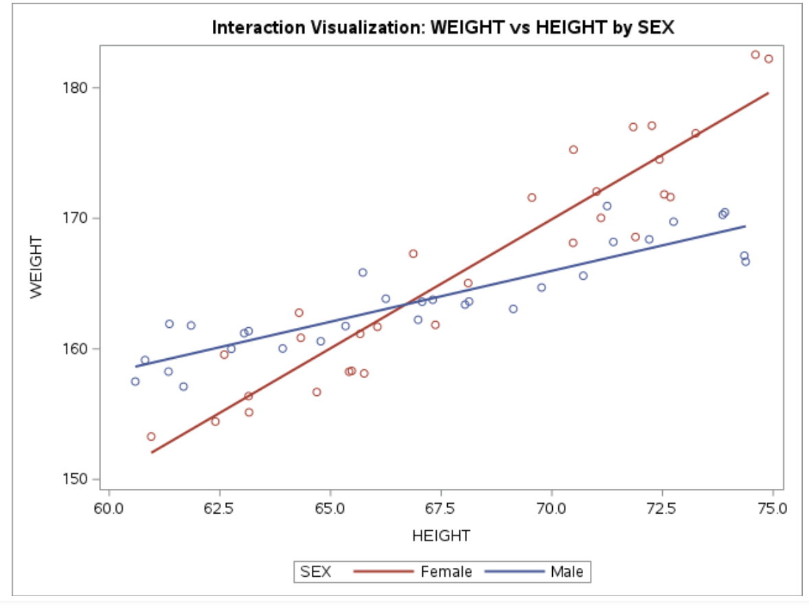
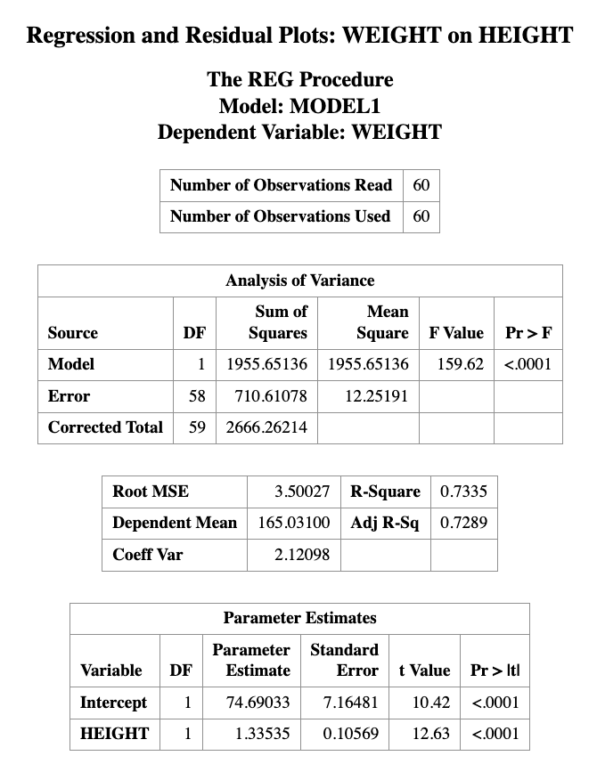
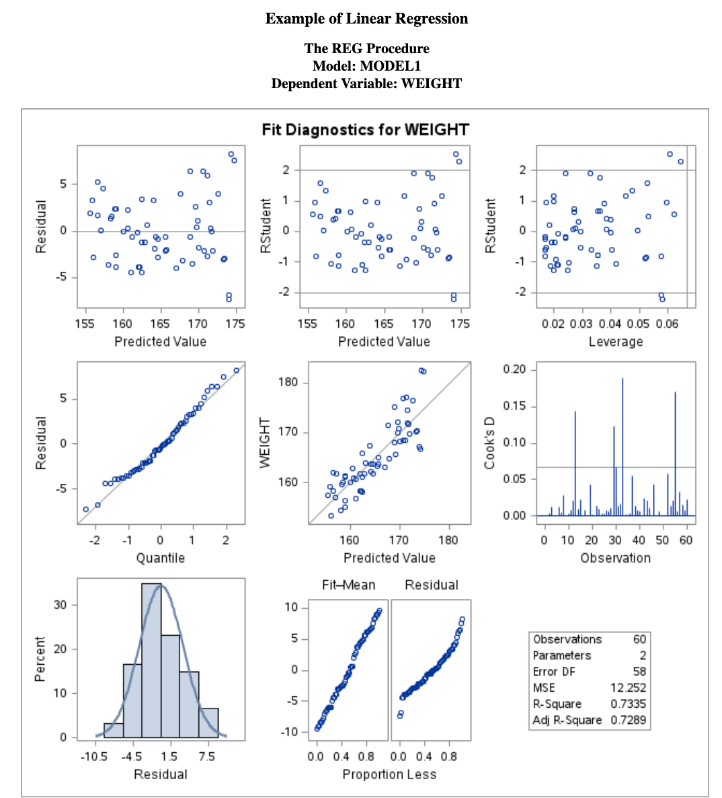
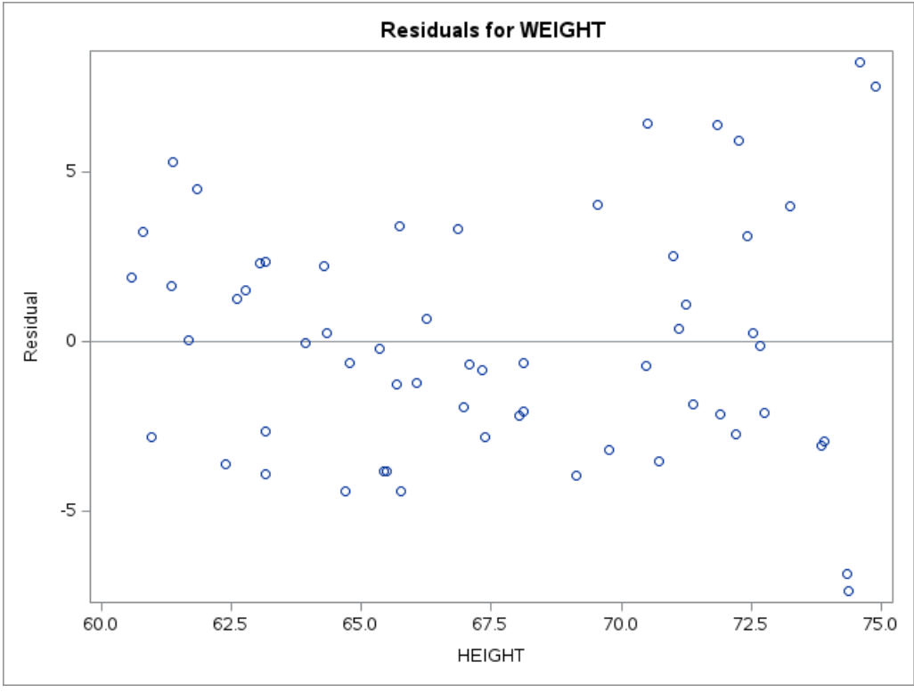
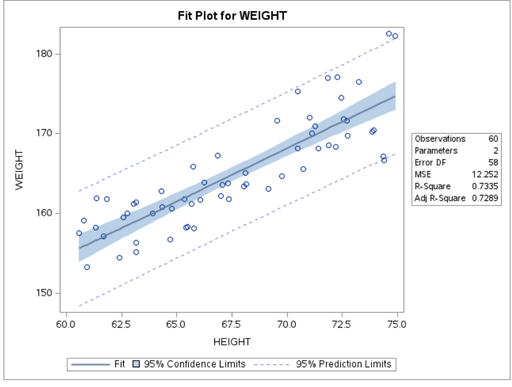
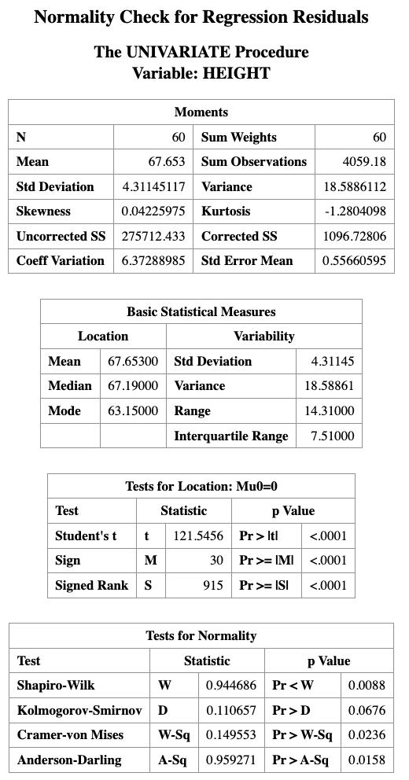
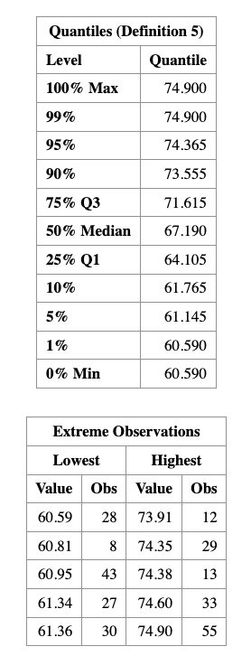
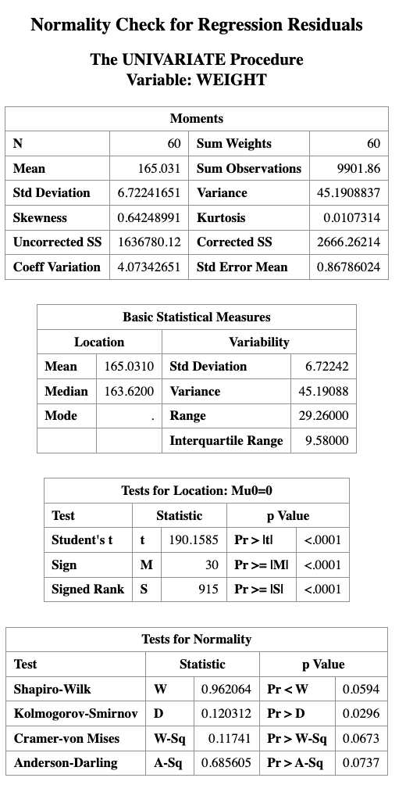

# Regression with Interaction

> Learning Objectives
>
> 1.  Understand interaction effects in regression models\
> 2.  Distinguish between main effects and interaction effects\
> 3.  Interpret regression coefficients in an interaction model\
> 4.  Compute and interpret simple slopes

## Why Do We Need Interaction?

In many real-world problems, the effect of one variable may depend on another variable.

For example:

-   Does the effect of study time depend on gender?
-   Does treatment effectiveness depend on age?
-   Does price sensitivity depend on income?

If the relationship between predictors is not constant, a simple additive model is not sufficient.

This motivates the need for **interaction terms**.

> Without interaction → parallel lines\
> With interaction → non-parallel lines

## Visualizing Interaction Effects

The easiest way to understand interaction is through visualization.

::: {.callout-important title="How to visually detect interaction"}
For two groups:

-   **Parallel regression lines** suggest **no interaction**
-   **Non-parallel regression lines** suggest **interaction**
-   **Crossing lines** indicate a strong interaction effect
:::

```{r interaction-illustartion, echo=FALSE, message=FALSE, warning=FALSE}
library(ggplot2)
library(patchwork)

set.seed(8310)
n <- 30

# -----------------------------
# Example 1: No interaction
# Parallel lines
# -----------------------------
male_no <- data.frame(sex = "Male", height = runif(n, 60, 75))
male_no$weight <- 70 + 1.8 * male_no$height + rnorm(n, 0, 2.5)

female_no <- data.frame(sex = "Female", height = runif(n, 60, 75))
female_no$weight <- 60 + 1.8 * female_no$height + rnorm(n, 0, 2.5)

dat_no <- rbind(male_no, female_no)

p1 <- ggplot(dat_no, aes(x = height, y = weight, color = sex)) +
  geom_point(size = 2, alpha = 0.8) +
  geom_smooth(method = "lm", se = FALSE) +
  labs(title = "No Interaction", x = "Height", y = "Weight") +
  theme_minimal(base_size = 14)

# -----------------------------
# Example 2: Interaction
# Crossing lines
# -----------------------------
male_int <- data.frame(sex = "Male", height = runif(n, 60, 75))
male_int$weight <- 110 + 0.8 * male_int$height + rnorm(n, 0, 2.5)

female_int <- data.frame(sex = "Female", height = runif(n, 60, 75))
female_int$weight <- 30 + 2.0 * female_int$height + rnorm(n, 0, 2.5)

dat_int <- rbind(male_int, female_int)

p2 <- ggplot(dat_int, aes(x = height, y = weight, color = sex)) +
  geom_point(size = 2, alpha = 0.8) +
  geom_smooth(method = "lm", se = FALSE) +
  labs(title = "Interaction (Crossing Lines)", x = "Height", y = "Weight") +
  theme_minimal(base_size = 14)

p1 + p2
```

``` r
PROC SGPLOT DATA=MEASUREMENT;
    TITLE "Interaction Visualization: WEIGHT vs HEIGHT by SEX";
    REG X=HEIGHT Y=WEIGHT / GROUP=SEX;
RUN;
TITLE;
```



## Main-Effects Model vs Interaction Model

A **main-effects model** assumes each predictor has a constant effect across all levels of the other predictors.

For example, suppose we want to predict *weight* using a person’s *sex* and *height*. A regression model with only main effects can be written as

$$
\text{weight} = \beta_0 + \beta_s \text{SEX} + \beta_h \text{HEIGHT}
$$

The coefficient $\beta_h$ represents a weighted average of the height effects for males and females, had we modeled them separately.

Thus, the main-effects model assumes that the effect of height is the same for both males and females. However, if the effect of height differs by sex, then we need an **interaction term**.

The regression model with interaction becomes

$$
\text{weight}
=
\beta_0
+
\beta_s \text{SEX}
+
\beta_h \text{HEIGHT}
+
\beta_{sh}(\text{SEX} \times \text{HEIGHT})
$$

::: {.callout-warning title="Important"}
In a regression model that includes **interaction terms**, the coefficients of the individual variables are **no longer interpreted as overall main effects**.

Instead, they represent the effect **when the interacting variable equals 0**.
:::

Thus:

-   $\beta_h$ represents the effect of **HEIGHT when SEX = 0**
-   $\beta_s$ represents the effect of **SEX when HEIGHT = 0**

If we code

-   SEX = 0 → male\
-   SEX = 1 → female

then we can construct the regression equations for **males and females** separately.

## Regression Equations by Group

Substitute $SEX = 0$ into the interaction model:

$$
\begin{aligned}
\text{weight}_{male}
&= \beta_0 + \beta_s(0) + \beta_h \text{HEIGHT} + \beta_{sh}(0)\text{HEIGHT} \\
&= \beta_0 + \beta_h \text{HEIGHT}
\end{aligned}
$$

Substitute $SEX = 1$:

$$
\begin{aligned}
\text{weight}_{female}
&= \beta_0 + \beta_s(1) + \beta_h \text{HEIGHT} + \beta_{sh}(1)\text{HEIGHT} \\
&= \beta_0 + \beta_s + \beta_h \text{HEIGHT} + \beta_{sh}\text{HEIGHT} \\
&= \beta_0 + \beta_s + (\beta_h + \beta_{sh})\text{HEIGHT}
\end{aligned}
$$

Thus, **slope for males** is $\beta_h$ and the **slope for females** is $\beta_h + \beta_{sh}$.

## Interpreting the Interaction Coefficient

From the previous equations, we can see that the effect of **HEIGHT** differs for males and females.

-   For males (SEX = 0), the slope of height is $$
    \beta_h
    $$

-   For females (SEX = 1), the slope of height is $$
    \beta_h + \beta_{sh}
    $$

Thus, **HEIGHT has a different effect for males and females**.

The interaction coefficient

$$
\beta_{sh}
$$

represents the **difference between the height effects for males and females**.

In other words, a one-unit increase in **SEX** (changing from male to female) changes the slope of **HEIGHT** by $\beta_{sh}$.

It is important to note that this interpretation holds when the **main effects are included in the model together with the interaction term**.\
If the interaction term were entered **without the corresponding main effects**, the interpretation of the coefficient would change.

::: {.callout-example title="A Numerical Example"}
Suppose the fitted model is

$$
\widehat{\text{weight}}
=
20 + 5\text{SEX} + 2\text{HEIGHT} + 1(\text{SEX}\times\text{HEIGHT})
$$

Then:

-   Male slope = 2
-   Female slope = 2 + 1 = 3

Interpretation:

-   For males, a one-unit increase in height increases expected weight by 2 units.
-   For females, a one-unit increase in height increases expected weight by 3 units.

Thus, the effect of height is stronger for females.
:::

## SAS Implementation

### Example dataset

``` r
DATA MEASUREMENT;
INPUT SEX $ HEIGHT WEIGHT;
DATALINES;
Male 67.07 163.61
Male 66.98 162.23
Male 69.13 163.06
Male 67.31 163.76
Male 66.25 163.84
Male 72.20 168.39
Male 71.39 168.19
Male 60.81 159.14
Male 64.78 160.58
Male 68.13 163.63
Male 63.15 161.36
Male 73.91 170.46
Male 74.38 166.68
Male 69.77 164.70
Male 73.86 170.27
Male 65.34 161.75
Male 72.75 169.74
Male 63.92 160.03
Male 61.85 161.79
Male 71.25 170.94
Male 61.68 157.11
Male 70.71 165.60
Male 65.73 165.85
Male 68.04 163.39
Male 62.76 160.00
Male 63.05 161.20
Male 61.34 158.26
Male 60.59 157.50
Male 74.35 167.14
Male 61.36 161.91
Female 65.42 158.25
Female 65.76 158.12
Female 74.60 182.54
Female 65.67 161.15
Female 66.06 161.69
Female 62.60 159.56
Female 72.26 177.10
Female 65.48 158.31
Female 66.87 167.29
Female 64.29 162.77
Female 71.11 170.03
Female 62.40 154.43
Female 60.95 153.28
Female 63.15 156.38
Female 72.54 171.83
Female 70.49 175.26
Female 72.68 171.63
Female 67.37 161.84
Female 68.11 165.04
Female 70.48 168.12
Female 64.33 160.85
Female 71.84 177.00
Female 69.55 171.59
Female 64.69 156.69
Female 74.90 182.22
Female 71.89 168.57
Female 73.25 176.51
Female 72.43 174.51
Female 71.01 172.05
Female 63.16 155.14
;
RUN;
```

### Fit the interaction model in SAS

``` r
PROC GLM DATA=MEASUREMENT;
CLASS SEX;
MODEL WEIGHT = HEIGHT SEX HEIGHT*SEX;
STORE INTMODEL;
RUN;
```

### Plot fitted interaction in SAS

``` r
PROC PLM RESTORE=INTMODEL;
EFFECTPLOT INTERACTION(X=HEIGHT SLICEBY=SEX);
RUN;
```

### Quick visualization in SAS

``` r
PROC SGPLOT DATA=MEASUREMENT;
TITLE "Interaction Visualization: WEIGHT vs HEIGHT by SEX";
REG X=HEIGHT Y=WEIGHT / GROUP=SEX;
RUN;
TITLE;
```

## Checking Regression Assumptions in SAS

The following SAS code fits a regression model and produces diagnostic plots for checking model assumptions.

``` r
PROC REG DATA=MEASUREMENT;
    TITLE "Regression and Residual Plots";
    MODEL WEIGHT = HEIGHT;
    OUTPUT OUT=MYOUT R=RESID;
RUN;

PROC UNIVARIATE DATA=MYOUT NORMAL;
    QQPLOT RESID / NORMAL(MU=EST SIGMA=EST COLOR=RED L=1);
RUN;
```















Description of the Code

-   `PROC REG` fits the linear regression model relating weight to height.
-   `OUTPUT OUT=MYOUT R=RESID` saves the residual values from the regression model into a new dataset called `MYOUT`.
-   `PROC UNIVARIATE` is used to examine the distribution of the residuals.
-   `QQPLOT RESID` produces a Q–Q plot to visually assess whether the residuals follow a normal distribution.

## PROC PLM

This section relies heavily on **PROC PLM** to estimate, compare, and visualize the **conditional effects of interactions**. Before applying it to interaction models, we briefly introduce **PROC PLM** in general.

`PROC PLM` performs various analyses and plotting functions **after a regression model has been fitted**. It can be used for:

-   testing **custom hypotheses** about model parameters
-   computing **predicted values**
-   estimating **simple effects and contrasts**
-   creating **visualizations of predicted values**

Unlike most SAS procedures, **PROC PLM does not directly use a dataset as input**.\
Instead, it reads from an **item store**, which contains information about a previously fitted model.

An item store can be created by several SAS modeling procedures, including:

-   `PROC GLM`
-   `PROC GENMOD`
-   `PROC LOGISTIC`
-   `PROC PHREG`
-   `PROC MIXED`
-   `PROC GLIMMIX`

These procedures create the item store using a `STORE` statement.\
Later, `PROC PLM` accesses this stored model using the `RESTORE=` option.

### Example with PROC PLM

``` r
DATA EXERCISE;
    INPUT HOURS EFFORT $ LOSS;
    DATALINES;
1 Low 3.0
2 Low 4.0
3 Low 5.0
4 Low 6.0
5 Low 7.0
1 High 2.0
2 High 4.0
3 High 7.0
4 High 11.0
5 High 16.0
;
RUN;
```

``` r
PROC GLM DATA=EXERCISE;
    CLASS EFFORT;
    MODEL LOSS = HOURS|EFFORT;
    STORE CONTCONT;
RUN;

PROC PLM RESTORE=CONTCONT;
    EFFECTPLOT SLICEFIT(X=HOURS SLICEBY=EFFORT);
RUN;
```

::: {.callout-note title="Key Takeaways"}

-   Interaction means the effect of one variable depends on another\
-   Main effects are no longer “global effects”\
-   Always interpret **simple slopes**\
-   Visualization is the easiest way to detect interaction

:::
