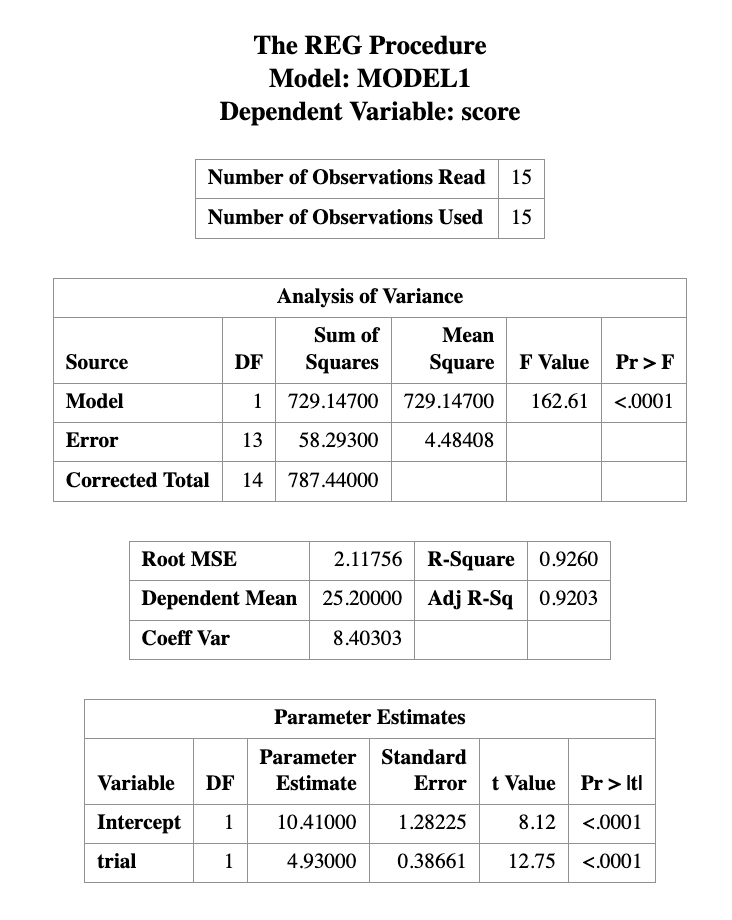
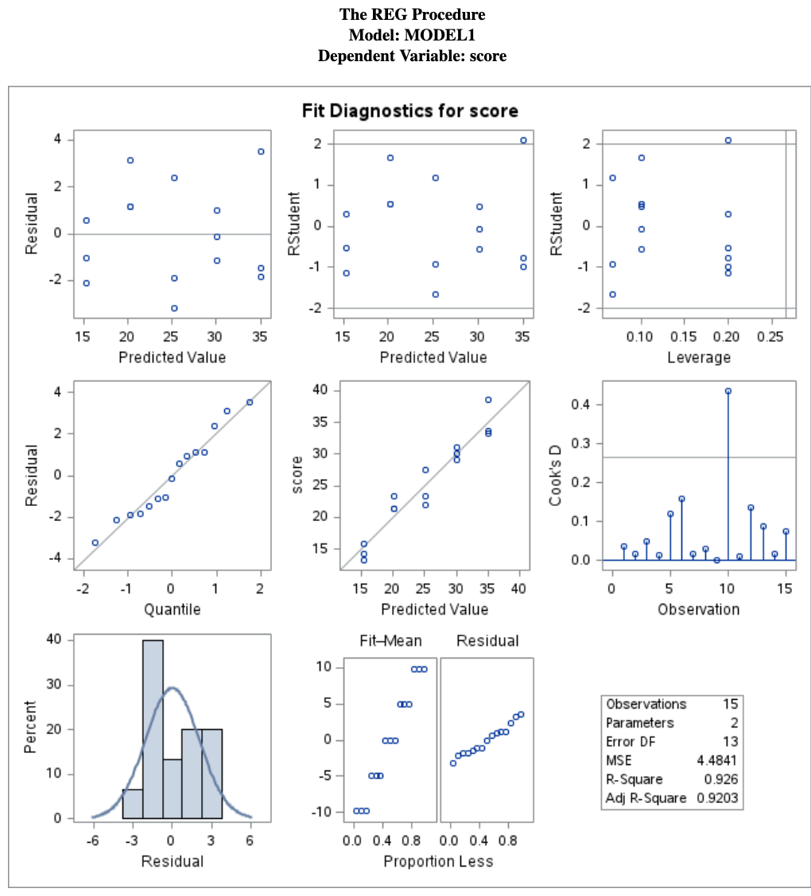
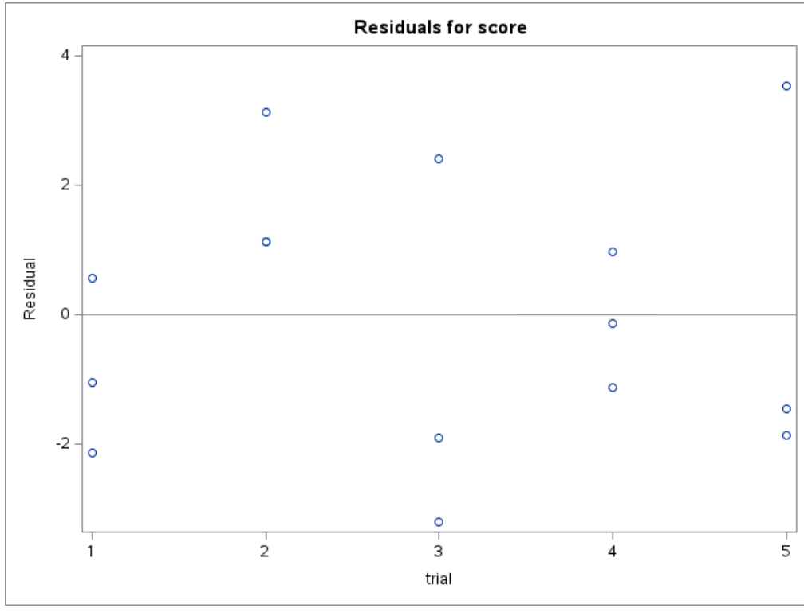
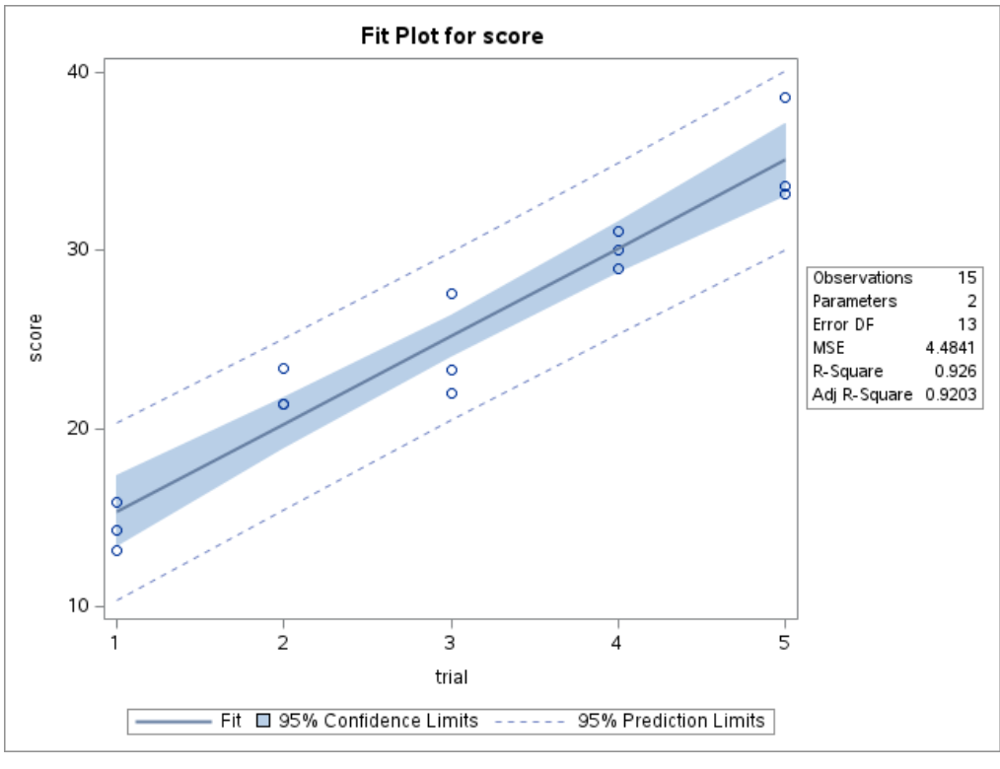
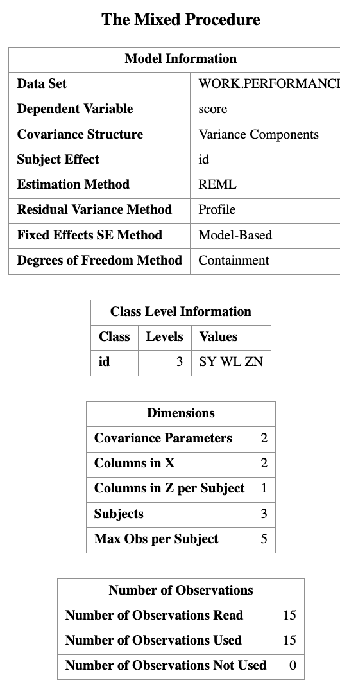
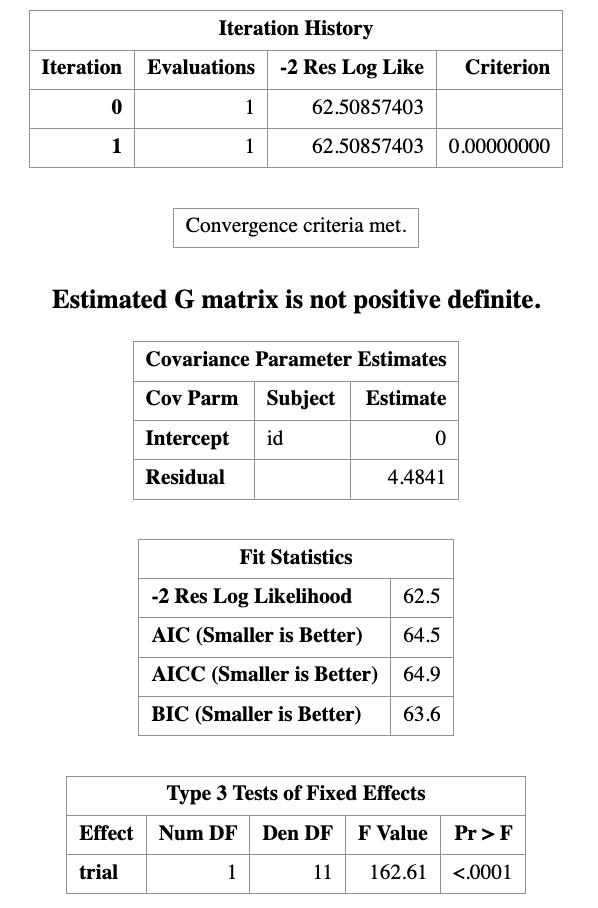
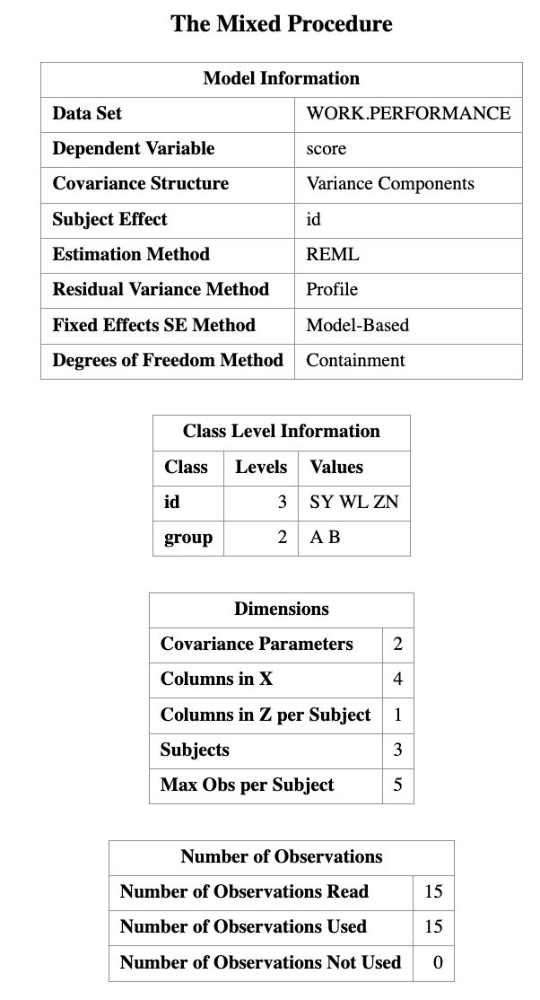
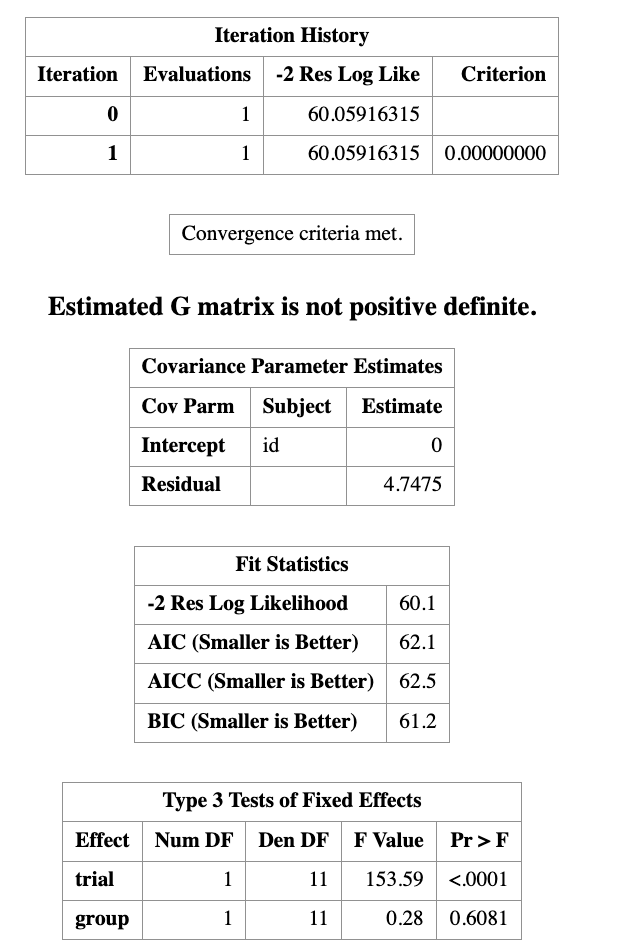
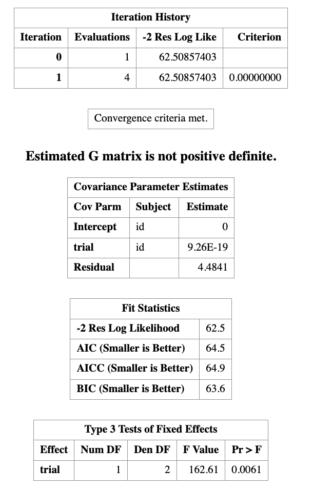

# Linear Mixed Effect Models I

> Learning Objectives
>
> By the end of this lecture, you should be able to:
>
> 1. Understand why **ordinary linear regression may fail** for correlated data  
> 2. Distinguish between **fixed effects** and **random effects**  
> 3. Recognize **clustered** and **longitudinal** data structures  
> 4. Write down the basic form of a **linear mixed effect model**  
> 5. Fit a simple mixed model in **SAS using `PROC MIXED`**  

## Introduction

In previous lectures, we studied linear regression models of the form

$$
Y_i = \beta_0 + \beta_1 X_i + \epsilon_i,
\qquad \epsilon_i \sim N(0, \sigma^2).
$$

A key assumption of this model is that the observations are **independent**.

However, in many real applications, this assumption is not reasonable. Observations often come in groups, or the same subject is measured repeatedly. In such settings, observations from the same group tend to be more similar to each other than to observations from other groups.

This leads to **correlated data**, and ordinary regression is no longer the right model.

## Two Common Settings Where Independence Fails

::: {.callout-definition title="Clustered Data"}

Clustered data arise when observations are grouped into natural clusters.

Examples include:

- students within schools
- patients within hospitals
- calves within farms

Observations within the same cluster tend to be similar. So for subjects $j$ and $k$ in the same cluster $i$,

$$
\operatorname{Corr}(Y_{ij}, Y_{ik}) \neq 0.
$$

:::

::: {.callout-definition title="Longitudinal Data"}

Longitudinal data arise when the same subject is measured repeatedly over time or across repeated trials.

Examples include:

- repeated test scores from the same student
- monthly measurements from the same patient
- repeated performance scores from the same worker

For subject $i$, repeated measurements such as

$$
Y_{i1}, Y_{i2}, \dots, Y_{iT}
$$

are typically correlated.

:::

## Why Ordinary Regression Is Not Enough

If we ignore clustering or repeated measurements and fit an ordinary regression model, we often underestimate the variability in the data. As a result:

- p-values may be misleading
- confidence intervals may be too narrow
- conclusions may be overly optimistic

So the issue is not only the mean structure. We also need to model the **dependence structure** in the data.

::: {.callout-example title="Main Idea"}

Ordinary regression focuses on the **average relationship**.

Mixed models do two things at the same time:

- model the **average relationship**
- model the **within-group dependence**

:::

## Fixed Effects and Random Effects

To handle correlated data, we extend regression by adding **random effects**.

::: {.callout-definition title="Fixed Effects vs Random Effects"}

**Fixed Effects**

Fixed effects describe **population-level effects** that are of direct interest.

Examples:

- treatment group
- sex
- age
- trial number

If we write

$$
\beta_1 = \text{effect of treatment},
$$

then $\beta_1$ is a fixed effect parameter.

**Random Effects**

Random effects describe **group-specific deviations** from the overall population pattern.

For example, if subjects are measured repeatedly, each subject may have their own baseline level. We can write this as

$$
u_i \sim N(0, \sigma_u^2),
$$

where $u_i$ is the random effect for subject $i$.

:::

**Intuition**

- Fixed effects tell us about the **average relationship**
- Random effects allow each cluster or subject to have their **own deviation**

This leads to a model that combines both kinds of effects. That is why it is called a **mixed** model.

## Linear Mixed Effected model

::: {.callout-definition title="Simple linear mixed effect model"}

The simplest linear mixed effect model is the **random intercept model**, which is defined as 

$$
Y_{ij} = \beta_0 + \beta_1 X_{ij} + u_i + \epsilon_{ij},
$$

where:

- $\beta_0, \beta_1$ are fixed effects
- $u_i$ is a random effect for cluster or subject $i$
- $\epsilon_{ij}$ is the residual error

We usually assume

$$
u_i \sim N(0, \sigma_u^2),
\qquad
\epsilon_{ij} \sim N(0, \sigma^2),
$$

and that $u_i$ and $\epsilon_{ij}$ are independent.

:::


::: {.callout-example title="Interpretation"}

In this model:

- the fixed effects $\beta_0, \beta_1$ describe the overall trend
- the random effect $u_i$ allows subject $i$ to deviate from that overall trend
- the residual error $\epsilon_{ij}$ captures the remaining unexplained variation

:::

### Retionale behind of correlation in this model

Two observations from the same subject share the same random effect $u_i$. That is exactly what creates correlation.

For the same subject or cluster $i$,

$$
Y_{ij} = \beta_0 + \beta_1 X_{ij} + u_i + \epsilon_{ij},
$$

$$
Y_{ik} = \beta_0 + \beta_1 X_{ik} + u_i + \epsilon_{ik}.
$$

Because both contain the same $u_i$, they are correlated.

This is the main idea students should remember:

> the shared random effect makes observations from the same subject or cluster similar.

### Variance Structure

For the random intercept model,

$$
\operatorname{Var}(Y_{ij}) = \sigma_u^2 + \sigma^2
$$

and for two observations in the same cluster,

$$
\operatorname{Cov}(Y_{ij}, Y_{ik}) = \sigma_u^2.
$$

Therefore,

$$
\operatorname{Corr}(Y_{ij}, Y_{ik})
=
\frac{\sigma_u^2}{\sigma_u^2 + \sigma^2}.
$$

::: {.callout-note title="Key Interpretation"}

- $\sigma_u^2$ measures **between-subject** or **between-cluster** variability
- $\sigma^2$ measures **within-subject** variability
- If $\sigma_u^2$ is large, observations within the same subject are strongly correlated

:::

## SAS Computing example Dataset

To illustrate the idea, consider the following repeated-measures dataset.

``` r
DATA performance;
    INPUT id $ age group $ trial score;
    DATALINES;
SY 34 A 1 14.3
SY 34 A 2 21.4
SY 34 A 3 27.6
SY 34 A 4 31.1
SY 34 A 5 33.2
WL 33 A 1 13.2
WL 33 A 2 21.4
WL 33 A 3 23.3
WL 33 A 4 30.0
WL 33 A 5 38.6
ZN 43 B 1 15.9
ZN 43 B 2 23.4
ZN 43 B 3 22.0
ZN 43 B 4 29.0
ZN 43 B 5 33.6
;
RUN;
```

In this dataset:

- `score` is the response variable
- `trial` is a fixed effect
- `group` is a fixed effect
- `id` identifies the subject

Because each subject appears multiple times, the observations are not independent.

### Step 1: A Model That Ignores Correlation

If we fit ordinary regression,

```r
PROC REG DATA=performance;
    MODEL score = trial;
RUN;
QUIT;
```

this assumes all observations are independent.

That is not appropriate here, because repeated scores from the same person are likely correlated.







::: {.callout-warning title="Warning"}

`PROC REG` is not designed for repeated-measures data with within-subject dependence.

It may still produce estimates, but the inference can be misleading because the independence assumption is violated.

:::

### Step 2: Random Intercept Model

A natural first mixed model is the **random intercept model**.

```r
PROC MIXED DATA=performance;
    CLASS id;
    MODEL score = trial;
    RANDOM INTERCEPT / SUBJECT=id;
RUN;
```




This corresponds to the model

$$
Y_{ij} = \beta_0 + \beta_1 \, trial_{ij} + u_i + \epsilon_{ij}.
$$

**Interpretation**

- $\beta_0$ is the overall intercept
- $\beta_1$ is the average effect of trial
- $u_i$ allows each subject to have their own baseline level

So this model says:

> everyone follows the same overall slope, but each subject may start from a different intercept.


In the code above:

- `CLASS id;` tells SAS that `id` is a grouping variable
- `MODEL score = trial;` specifies the fixed-effects part of the model
- `RANDOM INTERCEPT / SUBJECT=id;` tells SAS to fit a subject-specific random intercept

This is usually the first mixed model to try when each subject is observed multiple times.

### Step 3: Add Another Fixed Effect

We can also include `group` as a fixed effect.

```r
PROC MIXED DATA=performance;
    CLASS id group;
    MODEL score = trial group;
    RANDOM INTERCEPT / SUBJECT=id;
RUN;
```


This corresponds to

$$
Y_{ij} = \beta_0 + \beta_1 \, trial_{ij} + \beta_2 \, group_i + u_i + \epsilon_{ij}.
$$

Now the model includes:

- an overall effect of trial
- an overall difference between groups
- a subject-specific random intercept




**Intuition**

- `trial` asks whether scores tend to change over trials
- `group` asks whether group A and group B differ on average
- `id` as a random effect accounts for repeated measurements on the same subject

### Step 4: Random Slope Model

A more flexible model allows the effect of trial to vary by subject.

```r
PROC MIXED DATA=performance;
    CLASS id;
    MODEL score = trial;
    RANDOM INTERCEPT trial / SUBJECT=id;
RUN;
```




This corresponds to

$$
Y_{ij} = \beta_0 + \beta_1 trial_{ij} + u_{0i} + u_{1i} trial_{ij} + \epsilon_{ij}.
$$

**Interpretation**

- $u_{0i}$ allows subject $i$ to have their own intercept
- $u_{1i}$ allows subject $i$ to have their own slope

This means different subjects can improve at different rates across trials.

::: {.callout-example title="Interpretation"}

- A **random intercept model** says subjects start at different levels
- A **random slope model** says subjects may also change at different rates

:::

## Conceptual Visualization

A helpful way to think about the difference between regression and mixed models is:

- ordinary regression: one fitted line for everyone
- random intercept model: many subject-specific lines with different intercepts
- random slope model: many subject-specific lines with different intercepts and different slopes

This is one reason mixed models are so useful for repeated-measures data.

## In-Class Questions

::: {.callout-exercise title="Question 1"}

Which variable is most appropriate as a random effect?

+ (A) `trial`
+ (B) `score`
+ (C) `id`
+ (D) `group`

:::

::: {.callout-exercise title="Question 2"}

Why include a random effect?

+ (A) To increase sample size
+ (B) To model dependence
+ (C) To remove variables
+ (D) To normalize the data

:::

::: {.callout-exercise title="Question 3"}

Ignoring clustering most directly leads to:

+ (A) Correct inference
+ (B) Smaller residuals
+ (C) Incorrect standard errors
+ (D) Better prediction

:::

## Summary of this class

This first lecture on linear mixed models is mainly about **intuition**.

The big picture is:

1. Ordinary regression assumes independence
2. Clustered and longitudinal data violate this assumption
3. Random effects are used to model within-group dependence
4. Mixed models combine:
   - fixed effects for the mean structure
   - random effects for the dependence structure

In the next lecture, we will go further into:

- more detailed interpretation of `PROC MIXED` output
- covariance structures
- repeated-measures formulations
- model comparison and diagnostics

::: {.callout-note title="Key Takeaways"}

- Mixed models are used when observations are **correlated**
- Two common settings are:
  - **clustered data**
  - **longitudinal data**
- Fixed effects describe **population-level effects**
- Random effects describe **subject- or cluster-specific deviations**
- A random effect creates correlation among observations from the same subject or cluster
- In SAS, the most basic mixed model can be fitted using `PROC MIXED`

:::
